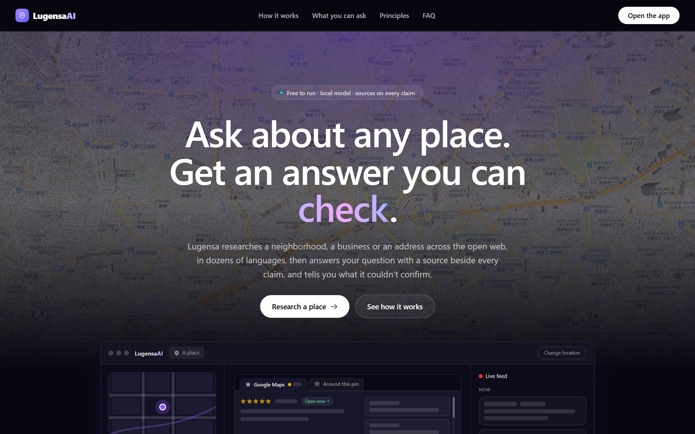
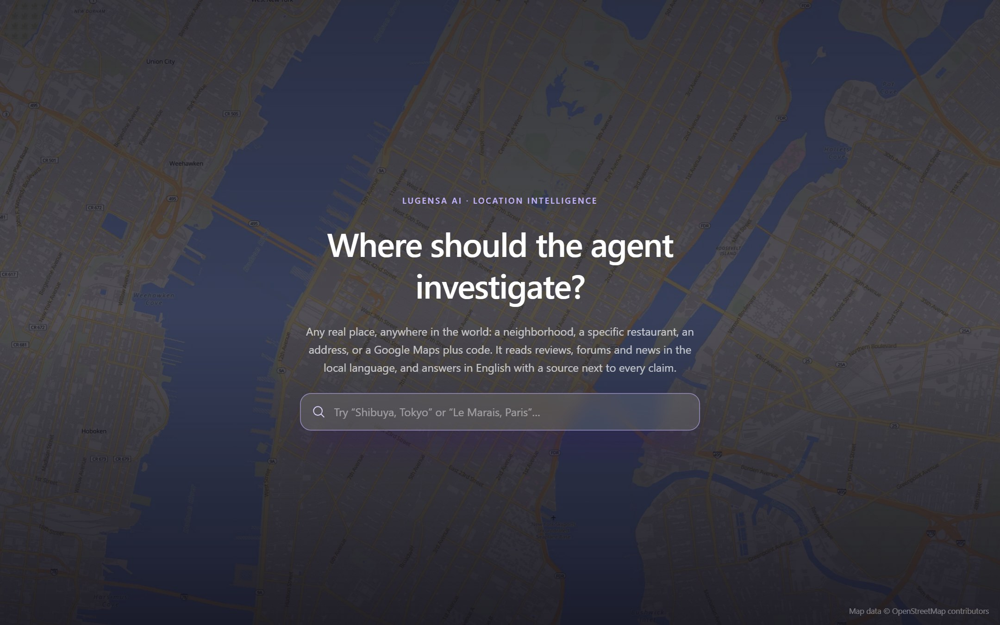
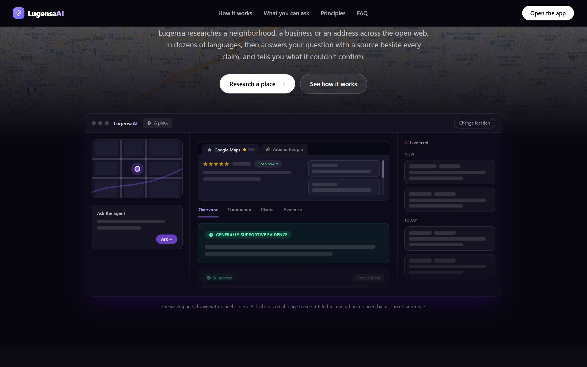
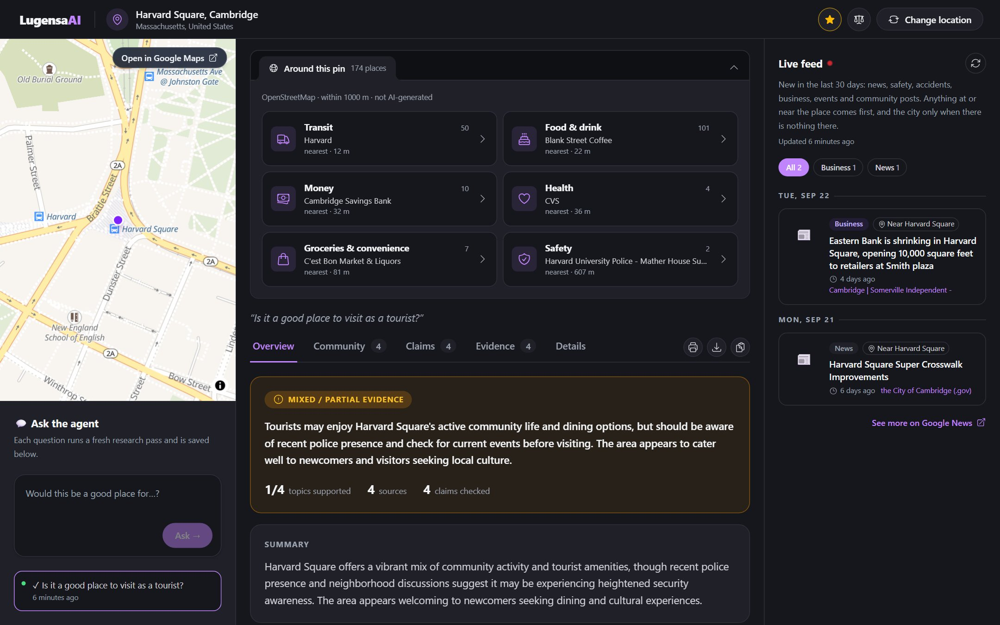
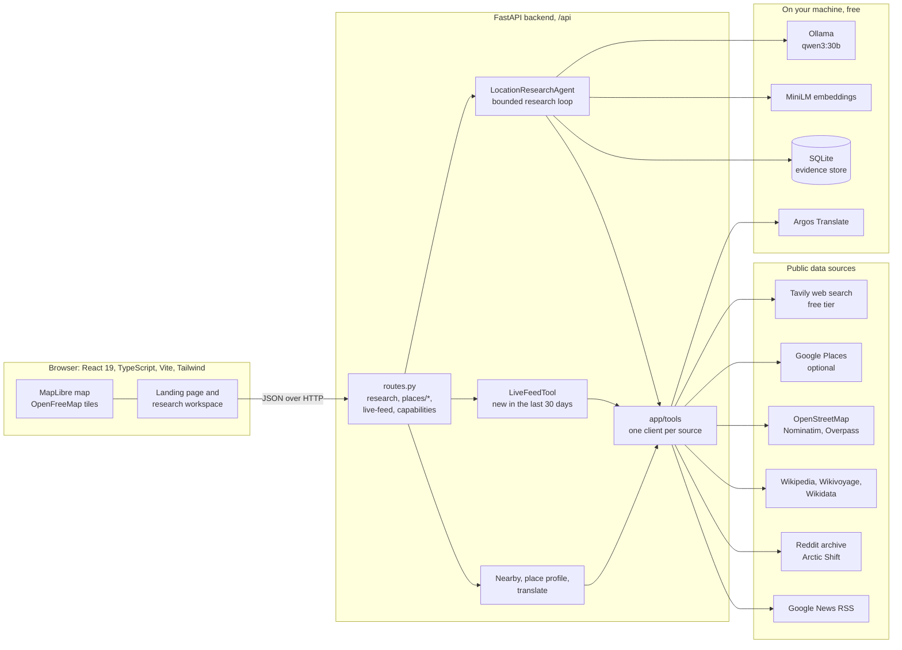
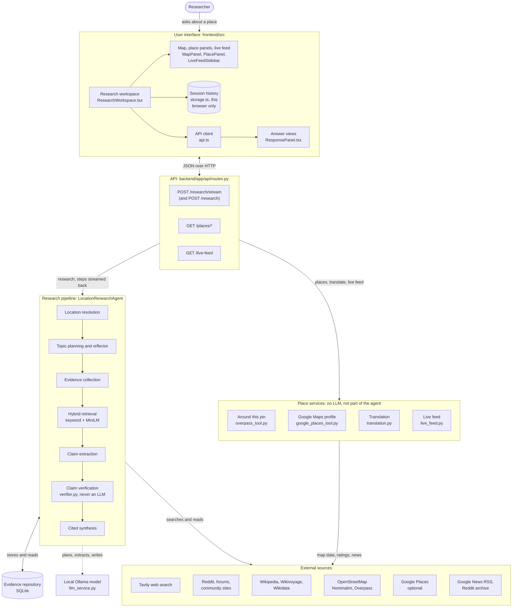
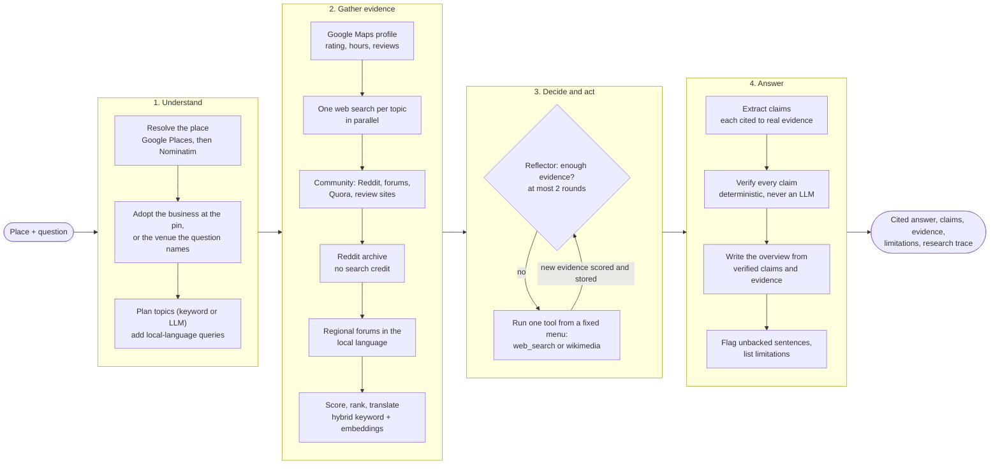
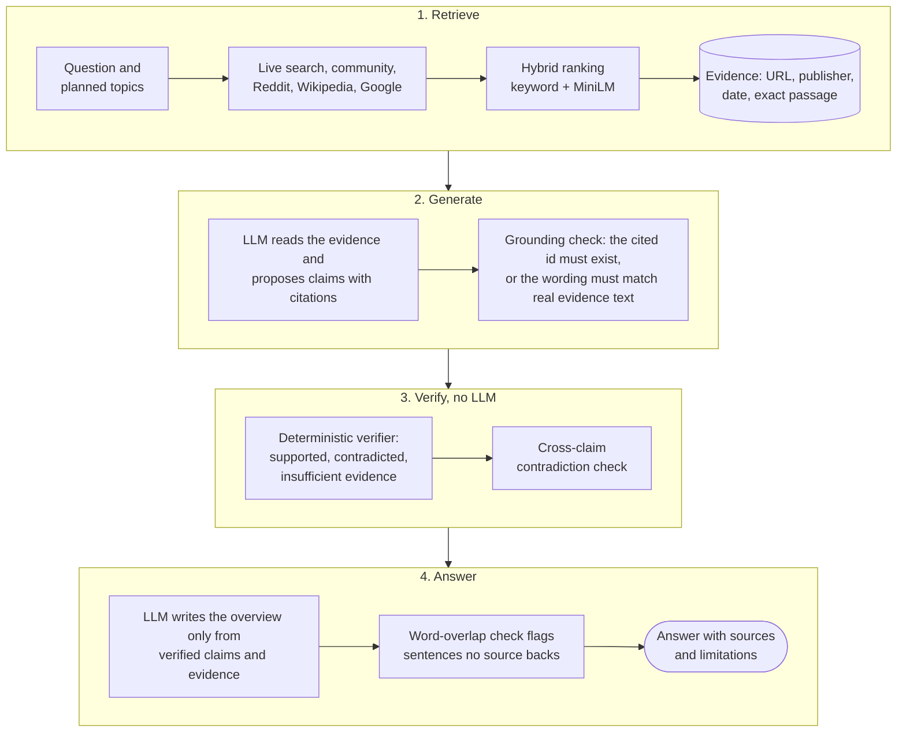
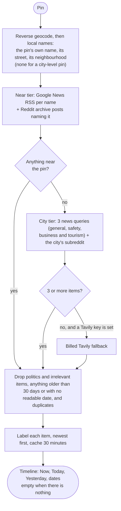
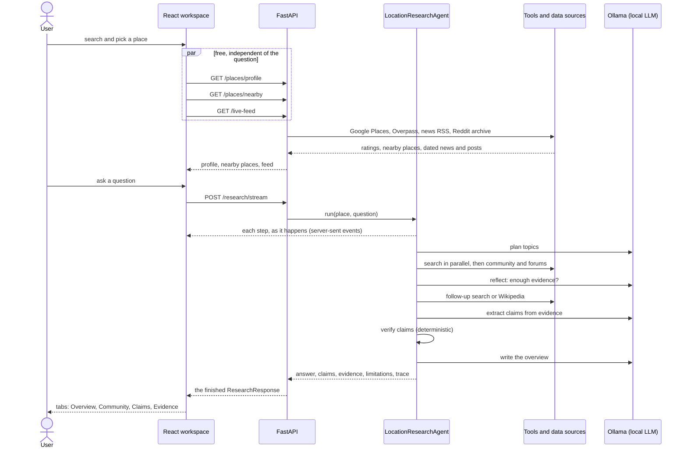

<div align="center">

# Lugensa AI

### Every claim about a place, traced to its source

[](https://github.com/anishneu/LugensaAI/actions/workflows/ci.yml)
[](LICENSE)




</div>

Lugensa AI is an agentic research system that investigates the public information about a place to answer a
natural-language question about it, such as *"Would Harvard Square, Cambridge, MA be a good place for a college
student?"* or *"Is there a bar near this specific Starbucks, and how safe is the area?"*. Instead of a generic
recommendation it produces a transparent, evidence-backed, cited assessment: every claim carries its source,
is checked against that source by a fixed deterministic verifier, and anything it could not confirm is
listed. The map and chat interface are a demonstration environment; the research agent is the project.

It reads what people actually say (Google Maps reviews, Reddit, TripAdvisor and each country's own forums, in
their own language, translated to English), what the map data says is nearby (OpenStreetMap), what Wikipedia and
Wikivoyage say, and what has been published about the place in the last 30 days (a live feed of news,
safety, business and events). It runs on a local model through Ollama, so **there is no billed model API anywhere in
the project**, and it never invents data: with nothing configured it says so instead of making something up.

**Author:** Anish Kuila

**Status:** Working Progress

## Table of contents

- [Overview](#overview)
- [Tech stack](#tech-stack)
- [Screenshots](#screenshots)
  - [A real run](#a-real-run)
- [Architecture](#architecture)
  - [System](#system)
  - [Components](#components)
  - [The research pipeline](#the-research-pipeline)
  - [Retrieval-augmented generation and verification](#retrieval-augmented-generation-and-verification)
  - [The live feed](#the-live-feed)
  - [One request, end to end](#one-request-end-to-end)
  - [Where the agentic AI and the RAG are](#where-the-agentic-ai-and-the-rag-are)
- [Features](#features)
- [Quick start](#quick-start)
- [Configuration](#configuration)
- [Project structure](#project-structure)
- [Testing](#testing)
- [Continuous integration](#continuous-integration)
- [Evaluation](#evaluation)
- [Documentation](#documentation)
- [License](#license)

## Overview

Given a location and a question, the agent:

1. Resolves the location.
2. Plans which research topics are actually relevant to the question (not a fixed checklist).
3. Retrieves evidence for each topic from live web search (including community and forum
   commentary), Wikipedia and Wikivoyage and, optionally, Google Places. (OpenStreetMap resolves the place and fills the
   "Around this pin" panel; it is not an evidence source for the answer.)
4. Extracts and verifies claims against that evidence, including a cross-source contradiction
   check.
5. Synthesizes a cited, hedged answer — never a confident-sounding guess with no source behind
   it — and reports what it couldn't confirm.

Real research needs two things, both free: live web search (`TAVILY_API_KEY`, free tier) and
LLM-backed reasoning through a local model, `OLLAMA_ENABLED` (needs [Ollama](https://ollama.com)
installed; nothing leaves your machine, and there is no billed model API anywhere in the project)
— see [Configuration](#configuration). **Nothing is faked:** with neither set, the app runs but has
nothing to search, returns no evidence or claims, and says so in every response. It never falls back
to made-up sample data.

## Tech stack

Every badge links to the project's own site.

<p><b>Backend</b><br>
<a href="https://www.python.org"></a>
<a href="https://fastapi.tiangolo.com"></a>
<a href="https://docs.pydantic.dev"></a>
<a href="https://www.sqlite.org"></a>
<a href="https://www.python-httpx.org"></a>
</p>

<p><b>AI and retrieval</b><br>
<a href="https://ollama.com"></a>
<a href="https://ollama.com/library/qwen3"></a>
<a href="https://www.sbert.net"></a>
<a href="https://pytorch.org"></a>
<a href="https://github.com/argosopentech/argos-translate"></a>
<a href="https://tavily.com"></a>
</p>

<p><b>Frontend</b><br>
<a href="https://react.dev"></a>
<a href="https://www.typescriptlang.org"></a>
<a href="https://vite.dev"></a>
<a href="https://tailwindcss.com"></a>
<a href="https://headlessui.com"></a>
<a href="https://reactrouter.com"></a>
<a href="https://maplibre.org"></a>
</p>

<p><b>Data sources</b><br>
<a href="https://www.openstreetmap.org"></a>
<a href="https://developers.google.com/maps"></a>
<a href="https://www.wikipedia.org"></a>
<a href="https://www.wikidata.org"></a>
<a href="https://www.reddit.com"></a>
<a href="https://news.google.com"></a>
</p>

<p><b>Quality and delivery</b><br>
<a href="https://docs.pytest.org"></a>
<a href="https://github.com/features/actions"></a>
<a href="https://codeql.github.com"></a>
<a href="https://docs.github.com/en/code-security/dependabot"></a>
<a href="https://mermaid.js.org"></a>
</p>

## Screenshots

Captured from a local run on 20 September 2026. The live feed items are real and dated as of that day; the landing
page's workspace preview is drawn with placeholder bars on purpose, because it states nothing about any real place.

<table>
  <tr>
    <td width="50%"><br><sub><b>Search.</b> Any place in the world: a neighbourhood, a business, an address or a plus code.</sub></td>
    <td width="50%"><br><sub><b>The workspace, previewed on the landing page.</b> Map and question on the left, answer in the middle, live feed on the right.</sub></td>
  </tr>
</table>



<sub><b>The workspace for Harvard Square.</b> "Around this pin" lists what OpenStreetMap has within 1,000 m (not AI-generated). On the right, the live feed
with its blinking red dot: items from the last 30 days, newest first, each labelled with its kind and the place it is about ("Near Harvard Square").</sub>

### A real run


<sub><b>A real run, not a mock-up, recorded in free mode:</b> no web-search key (so no search credit was spent), the local model, the free Reddit
archive and OpenStreetMap. The four-minute model wait is sped up about 30 times. Because nothing was web-searched, the answer is thin
on purpose: the Details tab says what was not searched, and the one claim the model made is marked "insufficient evidence" because its
wording was not found in the source it cited. That is the app doing what it is for, not a polished result; with a search key the agent also has web pages to work from.</sub>

## Architecture

The diagrams below are Mermaid, so GitHub draws them; the text under each says what it shows and, where it
matters, what it does not.

### System

A React front end talks to one FastAPI service. The service holds the research agent, the live feed and the place endpoints;
all three reach the outside world only through `backend/app/tools`, one small client per source. The AI parts (the LLM, the
embedding model, the translator) run on your machine.



### Components

The same system by component, with the files that implement each part. Two things it is easy to get wrong: the research agent does not call the live feed or the "Around this pin" lookup (they are separate place services behind their own endpoints), and OpenStreetMap enters the agent only through location resolution.



### The research pipeline

`LocationResearchAgent._run` (`backend/app/agents/location_research_agent.py`) is a fixed sequence with one decision loop in the middle.
The first pass is deterministic: plan topics, search each once, score, keep what clears the relevance bar. After it, a
*reflector* looks at what was found and either stops or picks one tool from a fixed menu (a follow-up web search aimed at the
question, or Wikipedia/Wikivoyage), at most twice. Every stage is written into the response's `research_trace`.



### Retrieval-augmented generation and verification

The model never answers from memory. It only sees retrieved evidence, and what it writes is checked twice: each claim against
its cited source by a deterministic verifier (never an LLM), and each overview sentence against the retrieved text.



### The live feed

A separate surface from the question-and-answer pipeline: what is new about the place in the last 30 days. It looks at the pin
first and only widens to the city when nothing is found there. It is free by default (Google News RSS and the Reddit archive);
the billed search is a fallback below three items.



### One request, end to end



### Where the agentic AI and the RAG are

| | Where | What it is, and what it is not |
|---|---|---|
| **RAG** | `tools/` (retrieval), `retrieval/` (keyword + MiniLM hybrid ranking), `evidence/` (store), `synthesis/` (generation) | Live evidence from web search, forums, Reddit, Wikipedia and Google Maps is retrieved and ranked, and the model writes only from it, with a source on every claim. Retrieval is per run, not a pre-built vector index. |
| **Agentic behaviour** | `agents/location_research_agent.py`, `agents/reflection.py`, `planning/` | The model plans which topics matter, and after the first pass a reflector decides what to do next (search again with a new query, consult Wikipedia, or stop) under a tool-call budget. It is a **bounded loop over a fixed menu of two tools**, not an open-ended autonomous agent: it does not write code, browse freely or plan across questions. |
| **Deterministic on purpose** | `verification/`, `tools/live_feed.py`, `tools/feed_topics.py`, nearby places | The verifier that marks a claim supported or contradicted is never an LLM. The live feed and "Around this pin" are rules and map data, not model output. |
| **Local ML, not an LLM** | Argos Translate, `sentence-transformers` | Translation and embeddings run locally and are free; they are models, but they do not reason or write. |

Full reasoning for each choice is in [`docs/architecture.md`](docs/architecture.md) and [`docs/research-workflow.md`](docs/research-workflow.md).

## Features

- **Any real place** — search resolves any point of interest (a specific business, address,
  building, or Google Maps plus code) via Google Places when configured, else free OpenStreetMap
  Nominatim. Picking one exact result from live search is passed straight
  through to research without being re-resolved as text, so a same-named place nearby can't be
  silently substituted.
- **Works for places in any language** — search results come back with English names, and
  foreign-language sources are machine-translated to English (free, local, via Argos Translate),
  labeled as translated, with the original one click away. Nearby food, transit, shops, health
  and police come from OpenStreetMap map data, not from an LLM.
- **Searches in the local language too** — an English query only finds English pages. For a place in
  a country whose web is written in another language, the agent also searches in that language using
  the place's native-script name, and matches pages on it. For a restaurant in Kurume, Japan this
  turned 3-4 sources (before, the English search had returned pages about a *different* hotel in
  Kyoto) into 10, seven of them Japanese pages about the right restaurant. About 60 countries have a
  curated language; English-speaking countries are searched in English; see
  [Working in any country](backend/README.md#working-in-any-country) for exactly what is and isn't
  covered, and `python -m evaluation.global_coverage` to check it yourself.
- **Adaptive planning** — a narrow question ("what's the nightlife like?") researches one topic;
  a broad one researches several. Topic selection is keyword-based by default, LLM-based if
  `OLLAMA_ENABLED` is set.
- **A specific business is researched as a business** — a cafe or hotel is searched by name, and a
  page only counts as evidence if it names the business's distinguishing words *and* the right
  city (so "SR Coffee" in Tokyo can't be answered with reviews of "SR Coffee" in Virginia). No
  soft fallback: another business's reviews are worse than an honest "nothing found".
- **Google Maps ratings wherever a place has them, without having to ask for them** — a general question ("is it a
  good place to visit as a tourist?") about a temple, a museum or a business gets its Google rating and reviews as
  evidence, and the rating opens the key findings. An address pin adopts the most popular place at it (the address of
  Ginkaku-ji is the temple), a corner adopts the venue the question names ("how are the reviews of this AO Arena?"),
  and an area, which is not one place, shows the best-known places around it with Google's ratings instead of
  attaching a neighbour's. The reviews appear beside those from TripAdvisor, Reddit and regional forums.
- **Google Maps data for that business (optional)** — with `GOOGLE_PLACES_API_KEY`, its rating,
  review count, hours and Google's own review summary become cited evidence and get a card in the
  UI, clearly labeled as Google's. **"Around this pin"** (food, transit, groceries, health, police,
  banks with computed walking distances) comes from OpenStreetMap map data, not from an LLM. The public
  Overpass servers are often slow for a dense city centre, so it tries five of them with their own timeouts,
  falls back to an earlier answer for that spot, and offers "Try again" rather than a dead end. Names and addresses in
  another script (Japanese, Chinese, Korean, Cyrillic, Arabic, Thai) can be translated to English on request with the
  free local translator, labeled as machine translation with the original beneath.
- **Hybrid retrieval** — keyword scoring by default, blended with local-embedding semantic
  scoring (`sentence-transformers`, no API key) when installed.
- **Real community voices** — a dedicated view of actual forum/review commentary (Reddit,
  Nextdoor, Google Maps, etc.), filterable by site and mixed across sites by default so one large source cannot bury the rest, about the specific selected location, including negative or mixed
  opinions and recent incident reports, shown for awareness rather than filtered out. Relevance is
  checked against the exact place (city and region, not just a same-named city elsewhere, and not
  just a chain's name with no city context) rather than the softer per-topic filter every other
  topic uses. Timestamps are never invented: a real publication date is shown when the source
  provides one — including one recovered from the page's own text (e.g. a review site's "Reviewed
  <date>" line) when the search API's own date field is empty — and every other item is labeled
  by when it was *retrieved*, explicitly, rather than shown with a fake "posted" time.
- **Forums, communities and regional sites, not only Google** — besides web search, each run searches the
  places where people actually talk about a place: Reddit, Quora, TripAdvisor and others everywhere, plus the
  country's own forums and review sites (PTT, Dcard and Pixnet in Taiwan, Naver in Korea, Tabelog in Japan,
  Pantip in Thailand, about 30 countries in all; `backend/app/tools/community_sources.py`). Those forums are
  searched separately, in the place's own language, because an English query never reaches them: with the
  native name and a topic ("台北101 觀景台 心得") a live run returned 8 relevant PTT and Pixnet threads.
  Evidence is shown English first (native English, or machine-translated), with the local-language original
  secondary and labeled.
- **Every post carries its real date where the source states one** — the search API gives none for forums,
  so it is read from the post: PTT's creation time is in the URL, Reddit's comes from a public archive of
  Reddit's own timestamps (one request for all threads), and blogs' from their page metadata
  (`backend/app/tools/post_dates.py`). A live run dated all 8 regional threads and all 8 Reddit threads.
  Where a source refuses a plain request (Dcard, Facebook, Instagram, TikTok, X: login walls and bot checks)
  the post is not shown in the live feed (which is limited to the last 30 days), never given a made-up date.
- **A live feed of what is new at and around the place** — separate from the Q&A pipeline and from the Community
  tab, marked by a blinking red dot. One timeline of the last 30 days, newest first under "Now", "Today", "Yesterday" and
  then dates: news, crime and safety, accidents and traffic, weather alerts, business, events and tourism, development and
  transport, and community posts, each labelled with its kind and with the place it is about. It looks at the pin first (its
  name, its street, its neighbourhood) and only when nothing is found there at the city; when there is not even that, it shows
  nothing. Politics and unrelated items (film trivia, sports scores, stock prices, personal asks) are left out. Every item has
  its *own* publication time; one with no readable date is dropped. Sources are free: Google News' public RSS feed for
  headlines and Reddit's public archive for posts, with the billed Tavily search only as a fallback when those find fewer than
  3 items, so a normal load spends no search credit (`backend/README.md`, "Live feed"). Never generated or reshuffled.
- **Readable descriptions, not page chrome** — a search snippet is markup, timestamps, bylines and menus joined
  together. The live feed and the evidence cards show whole sentences picked out of it (`backend/app/tools/descriptions.py`),
  never rewritten, and just the headline and source when no sentence qualifies.
- **An interface built to be read** — a landing page over a still street-map image (search happens in the app); then
  a top bar, a zoomed-in map and question box on the left, the answer in the middle, the live feed on the right,
  built with Tailwind and Headless UI over MapLibre and free OpenFreeMap tiles (no API key). No animation or 3D
  library: they were tried and removed. See [`frontend/README.md`](frontend/README.md).
- **Evidence-grounded answers, not reflexive "insufficient evidence"** — the Overview reasons over
  the full retrieved evidence (not only whatever survived atomic claim extraction), producing a
  direct answer, key findings, and question-organized details, while still never stating a fact
  the evidence doesn't support and never asserting an absolute safety claim ("no crime has ever
  happened here") from a mere absence of search hits.
- **Verification, not vibes** — claim status (supported / contradicted / insufficient evidence)
  is decided by a fixed, deterministic verifier — never by whichever component proposed the
  claim, and never by an LLM, regardless of which other components are LLM-backed. Claim
  grounding itself is also enforced deterministically: a claim is kept only if its cited evidence
  id validates, or its own wording is independently matched against real evidence text — never on
  an LLM's self-reported citation alone.
- **You watch it work** — a run takes minutes on a local model, so its steps are streamed to the page as the agent records
  them (`POST /api/research/stream`, server-sent events): "Selected Reddit archive search…", "Reading 14 evidence items
  to extract claims…", each one a real entry of the run's trace, in order. Nothing is estimated or invented: how many
  steps a run needs is not known until it ends, so there is no progress bar with a made-up percentage.
- **Compare two places, save places, take the answer with you** — "Compare" in the top bar asks the same question of a second
  place (one run after the other, since the local model is one machine) and shows both answers side by side with a table that
  counts what each run found: sources, kinds of source, supported and contradicted claims, limitations. It deliberately says
  nothing about which place is better, because nothing in the sources decides that. "Download report" saves an answer, or the
  comparison, as Markdown built in the browser from what is on screen (claims with the sources they rest on, limitations, a
  numbered source list); nothing is sent anywhere. The star opens a menu of saved places (kept in this browser only) to open or
  remove them.
- **More than one question at a time** — a prompt with several questions ("Is it safe? How is the food?") is split, the trace says
  so, and the answer is asked to address each in its own numbered paragraph and to say which one the evidence could not answer. A
  statement typed with a question mark is treated as context. The research itself is planned from the whole prompt.
- **Honest degradation** — every fallback (no LLM, no live search, an API failure, an
  off-topic result filtered out) is recorded in the response's `limitations`, not hidden.
- **A real evaluation, not just a plan** — [`docs/evaluation.md`](docs/evaluation.md) has actual
  numbers from a real benchmark run, including where the system did *not* win.

## Quick start

Two terminals.

**Backend:**

```bash
cd backend
python -m venv .venv
source .venv/Scripts/activate   # Windows: .venv\Scripts\activate
pip install -r requirements.txt
uvicorn app.main:app --reload --port 8000
```

**Frontend:**

```bash
cd frontend
npm install
npm run dev -- --port 3000
```

Open `http://localhost:3000`.

Full details, troubleshooting, and what each part does are in
[`backend/README.md`](backend/README.md) and [`frontend/README.md`](frontend/README.md).

## Configuration

Nothing below is required — the app is fully functional with none of it set. Copy
`backend/.env.example` to `backend/.env` to configure any of it (gitignored, never committed).

| Variable | Enables | Notes |
|---|---|---|
| `TAVILY_API_KEY` | Live web search + real community/forum evidence | Free tier available at [tavily.com](https://tavily.com) |
| `OLLAMA_ENABLED` | LLM-backed planning, claim extraction, and synthesis, via a local model | Free, but needs [Ollama](https://ollama.com) installed and a model pulled — see `backend/README.md` for which model, and why "thinking" mode must be off on CPU |
| `GOOGLE_PLACES_API_KEY` | Google Maps rating, hours and dated reviews for one specific business (or a venue the question names), used as cited evidence | Optional and off by default: needs a Google Cloud project with billing enabled. See `backend/README.md` |
| `DISABLE_TRANSLATION` | Turns off translation of foreign-language evidence to English | Translation is on when `argostranslate` and `langdetect` are installed (free, local; language packs download on first use) |
| `DISABLE_LIVE_GEOCODING` | Stops free OpenStreetMap place search and reverse geocoding | Set to `1` to run without Nominatim (the test suite sets this so it never touches the network) |
| `WIKIMEDIA_CONTACT` | The contact URL sent to Wikipedia/Wikivoyage/Wikidata | Wikimedia blocks clients that identify nothing. Defaults to this repository's URL; set it to your fork's |
| `DISABLE_NEWS_RSS` | Stops the live feed's free news source | Headlines from Google News' public RSS feed, with real dates: no key, no search credit. Set to `1` to turn it off |
| `DISABLE_REDDIT_ARCHIVE` | Stops the free Reddit archive search | Reddit posts about the place from Arctic Shift's public archive, by words in their titles: no key, no search credit, works without a Tavily key. Set to `1` to turn it off |
| `DISABLE_NAME_VARIANTS` | Stops the Wikidata lookup of a place's other names | Other English spellings of the name ("Pasak Chonlasit Dam" for "Pa Sak Jolasid Dam"), free, no key. Set to `1` to turn it off |
| `DISABLE_POST_DATE_FETCH` | Stops reading forum posts' dates from the web | Set to `1` to use only the dates carried in URLs (PTT, dated blog paths); Reddit and page-metadata dates need a small request each (no search credits) |
| `DISABLE_SEMANTIC_RETRIEVAL` | Forces keyword-only retrieval | Set to `1` to skip loading the local embedding model — the single biggest startup cost |

Setting `TAVILY_API_KEY` alone collects real evidence but produces no claims — reading claims out
of real pages needs a model, and the response says so. Set `OLLAMA_ENABLED` too for live search to
actually produce claims. See [`docs/research-workflow.md`](docs/research-workflow.md).

## Project structure

```
LugensaAI/
├── backend/
│   ├── app/
│   │   ├── agents/        LocationResearchAgent, the reflector (decide-and-act loop), factory.py (the one place that wires parts together)
│   │   ├── api/           FastAPI routes: research, places/*, live-feed, capabilities
│   │   ├── core/          configuration (.env), the LLM service (Ollama), shared JSON parsing
│   │   ├── evidence/      evidence store (in-memory, SQLite), enrichment, Google place profile
│   │   ├── models/        Pydantic schemas shared by every layer
│   │   ├── planning/      topic taxonomy, keyword planner, LLM planner, local-language queries
│   │   ├── retrieval/     keyword, semantic (MiniLM) and hybrid retrievers
│   │   ├── synthesis/     claim extraction (LLM, grounded), overview synthesis (template or LLM)
│   │   ├── tools/         one client per source: Tavily, Google Places, Nominatim, Overpass, Wikimedia, Wikidata,
│   │   │                  Reddit archive, Google News RSS, translation; plus live_feed.py and feed_topics.py
│   │   └── verification/  deterministic claim verifier and contradiction check
│   ├── evaluation/        the runnable benchmark from docs/evaluation.md
│   └── tests/             offline, deterministic pytest suite (563 tests)
├── frontend/
│   └── src/
│       ├── pages/         LandingPage, ResearchWorkspace
│       └── components/    workspace panels, live feed, map, place/ (Google Maps + Around this pin), landing/
├── docs/                  architecture.md, research-workflow.md, evaluation.md, images/
└── .github/               workflows (ci, codeql, secret-scan, dependency-audit, release), scripts, dependabot.yml
```

See [`backend/README.md`](backend/README.md) for the backend's internal layout.

## Testing

```bash
cd backend
pytest          # 563 tests
cd ../frontend
npm run lint && npx tsc -b && npm run build
npm run test:e2e   # 60 tests: 36 in a browser, 24 plain unit tests (PW_CHANNEL=msedge uses an installed browser; otherwise `npx playwright install chromium`)
```

The backend suite is free, offline, and deterministic by construction (its invented sample sources live
only in `backend/tests/fixtures` and are never served by the app; a test enforces that) — an autouse fixture forces real
API keys and semantic retrieval off during tests regardless of local `.env` configuration, so
`pytest` never makes a real network call or spends API credits.

The frontend's browser tests ([`frontend/e2e`](frontend/e2e)) run the real UI in a real browser against the Vite dev
server with every backend call mocked, so they need no backend, keys or network either. They cover the landing page, picking
a place, saving places, the live feed (empty state, "Now" grouping, kind filter), exporting an answer, comparing two places,
and the streamed research: the page shows each step as
the mocked server sends it, then the answer, an error, or the stream ending early. A set of plain unit tests covers the
event-stream parser, the text cleaner and the report builders. CI runs them after the build.

## Continuous integration

Everything under [`.github/workflows/`](.github/workflows/) runs on `ubuntu-latest` and needs no
secrets of yours — the test suite's autouse fixture forces every real key and optional feature off,
so CI is free, offline and deterministic just like a local `pytest`.

| Workflow | When | What it does |
|---|---|---|
| [`ci.yml`](.github/workflows/ci.yml) | every push and PR to `main`/`develop` | **Backend lint** (ruff: syntax errors, undefined names, unused imports/variables), **backend tests** (full `pytest`, with CPU-only PyTorch so the runner doesn't download CUDA), **frontend** (`npm ci`, `oxlint`, `tsc -b` + production build, build uploaded as an artifact). A newer push cancels the older run. |
| [`codeql.yml`](.github/workflows/codeql.yml) | push, PR, weekly | GitHub's static security analysis of the Python backend and the TypeScript frontend. Results go to code scanning where it exists; otherwise to a downloadable file and the job summary. |
| [`secret-scan.yml`](.github/workflows/secret-scan.yml) | every push and PR | Gitleaks over the full history, because a key committed once and deleted later is still leaked. |
| [`dependency-audit.yml`](.github/workflows/dependency-audit.yml) | PRs, weekly, manual | Dependency review on PRs (blocks newly introduced high-severity issues), plus `pip-audit` and `npm audit` on what is actually installed. |
| [`release.yml`](.github/workflows/release.yml) | pushing a `v*` tag | Re-runs tests, lint and build from that exact commit, then publishes a GitHub Release with generated notes and the frontend bundle attached. Never releases untested code. |
| [`dependabot.yml`](.github/dependabot.yml) | monthly | Grouped update PRs for pip, npm and the workflows themselves. |

**Why CodeQL failed on a private repository, and what was changed.** It failed twice, for two different reasons, both
after a clean analysis (every file was scanned). First: "Resource not accessible by integration ... get-a-workflow-run",
because on a private repo the CodeQL action reads its own workflow run through the API, which needs `actions: read`;
that permission is now granted. Second, and the one that remained: **"Code scanning is not enabled for this
repository"**, when the results are uploaded. Code scanning (the Security tab) exists for public repositories and, on a
private one, only with GitHub Code Security, so the upload can never work here whatever the workflow says. The workflow
now uploads only where it can (a public repository, or the repository variable `CODE_SCANNING` set to `true`); otherwise
it keeps the SARIF file as a downloadable artifact (`codeql-results-<language>`, 30 days) and prints any findings in the
job summary and as file annotations (`.github/scripts/codeql_summary.py`). That report never fails the job: a finding is
something to read. On a pull request from **Dependabot** the first message has a second cause no workflow setting fixes,
its read-only token, so the job skips Dependabot's PRs (the push and weekly scans cover the same code). The same token is
why the dependency review no longer posts a PR comment, and why the secret scan asks for `pull-requests: read`. The
dependency review has the same gate as the CodeQL upload, since on a private repo it needs the dependency graph.

Dependabot opens at most one grouped, minor-and-patch PR per ecosystem a month (two for pip and npm at a time) and no
major-version bumps; its PRs are ordinary PRs, safe to close (`@dependabot close`) or merge once CI is green.

These have been validated with `actionlint` and their commands run locally, but a workflow only
proves itself on GitHub — the first run of each is the real test.

One accepted exception: `pip-audit` runs with `--ignore-vuln PYSEC-2026-3075` (a `stanza` advisory). `stanza`
is pinned below the fixed version by `argostranslate`, which does the free local translation, so it can't be
upgraded without dropping that feature. The reason is written next to the flag in
[`dependency-audit.yml`](.github/workflows/dependency-audit.yml); remove it once Argos allows
`stanza >= 1.12.2`. CodeQL and the PR dependency review need GitHub itself and could not be reproduced locally.

## Evaluation

```bash
cd backend
python -m evaluation.run_benchmark
```

```bash
python -m evaluation.answer_quality report   # after collect and run: the answer-quality comparison
```

That second evaluation answers ten questions three ways on the local model, all from the same frozen free sources (no search
credit): the model alone, the model given every source, and the full pipeline. Headline: figures and names found in no source
were 53% of the model-alone answers, 10% with sources handed over, and 4% from the pipeline, but on ten cases and one run each,
so the gap between the last two is not shown to be reliable; the pipeline is about four times slower than the plain
source-stuffing baseline. It measures staying with the sources, not whether an answer is right. The method, the metric bug it
found in itself and what it does not show are in [`docs/evaluation.md`](docs/evaluation.md).

The first benchmark: runs the benchmark described in [`docs/evaluation.md`](docs/evaluation.md) for real — Baseline B
vs. the proposed system's orchestration — and prints/saves actual measured results, including
tradeoffs where the proposed system does *not* clearly win (e.g. more tool calls, more latency,
occasionally less source diversity). Requires `TAVILY_API_KEY`.

## Documentation

- [`backend/README.md`](backend/README.md) — run the agent and its API, environment variables,
  what each backend module does
- [`frontend/README.md`](frontend/README.md) — run the UI: its stack, the landing page and the workspace, and the
  map pitfalls found along the way
- [`docs/architecture.md`](docs/architecture.md) — design, interfaces, and what's opt-in vs. free
- [`docs/research-workflow.md`](docs/research-workflow.md) — the research lifecycle in detail
- [`docs/evaluation.md`](docs/evaluation.md) — the evaluation plan and its actual results
- [`CONTRIBUTING.md`](CONTRIBUTING.md) and [`SECURITY.md`](SECURITY.md) — how to contribute, and how to report a vulnerability privately

## License

Released under the MIT License. See [`LICENSE`](LICENSE).

## Author

**Anish Kuila** — [github.com/anishneu](https://github.com/anishneu)
