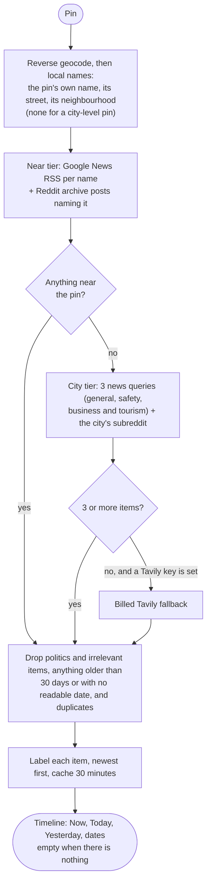

# Backend — LocationResearchAgent

The research pipeline described in [`docs/architecture.md`](../docs/architecture.md). It ships
no sample data. `TAVILY_API_KEY` turns on live web search and `OLLAMA_ENABLED` turns on LLM-backed
reasoning (a free local model), independently of each other; with neither, the pipeline has nothing
to search and every response says so. Having `sentence-transformers` installed opts into hybrid
semantic retrieval automatically. Storage is a local SQLite file. See below for all of these.

## What this does and doesn't do

**Does:** resolve a location — any real point of interest, via Google Places when configured and
otherwise live geocoding (`NominatimLocationResolverTool`, free, opt-out via
`DISABLE_LIVE_GEOCODING=1`) — decompose a question into research topics (adaptively — a
nightlife-only question does not trigger housing research), retrieve and score evidence
(lexically, and semantically if available), extract claims and link them to the evidence that
supports them, verify those claims (including a coarse cross-source contradiction check), and
synthesize a transparent, cited answer — a direct summary, key findings, and question-organized
details, not just a claims list — with a full execution trace. Claim verification is always a
fixed, deterministic step — never LLM-backed, and it never moves in the pipeline — regardless of
which other components are in use (see `docs/research-workflow.md`).

**Doesn't:** act open-endedly. After the first search it may search again or consult Wikipedia and
Wikivoyage, but only twice and only from that fixed menu (see `docs/research-workflow.md`); it does
not write code or browse freely. And it doesn't invent data: **the product ships no sample places,
sources or claims.** Invented documents used to exist for two US neighborhoods and were served as if
they were research when no keys were set; they now live only in `tests/fixtures`, are never imported
by `app/`, and a test enforces that. With no search configured a response has no evidence and says why.

## Overview synthesis: evidence in, reasoning, an answer out

Early on, the Overview was gated entirely behind atomic claim extraction: no successfully
extracted claim meant no answer, just "insufficient evidence" — even when real, useful evidence
had been collected. Two changes fixed this:

1. **`LLMClaimExtractor` grounds claims by more than trusting a citation.** The LLM is asked to
   cite the evidence id/topic it used, and that citation is used directly when it validates. When
   it doesn't (a smaller model reliably fails this exact instruction — e.g. citing a source name
   it noticed inside the passage, like `"FBI Uniform Crime Reporting data"`, instead of the
   literal `[evidence_id]` token it was shown), `_best_matching_evidence()` recovers grounding
   deterministically: it checks the claim's own wording against the real evidence text via
   lexical overlap, and only keeps the claim if that independent check clears a high bar. Either
   way, a claim's grounding is *checked*, never assumed from the LLM's self-report.
2. **`Synthesizer.synthesize()` sees the full evidence, not only claims that survived extraction.**
   `LLMSynthesizer`'s prompt is given verified claims *and* raw, per-topic evidence excerpts
   (labeled by source type, publisher, and date), with instructions to reason across both:
   prefer concrete facts/numbers, treat review/forum content as opinion rather than fact, present
   a "contradicted" claim as unresolved disagreement, never state a fact the evidence doesn't
   support, and — for safety/incident questions specifically — never claim something "hasn't
   happened" or "is safe" from a mere absence of search hits; say what the sources checked did
   and didn't turn up, with the time window, instead. `TemplateSynthesizer` (the free, non-LLM
   fallback) does the deterministic version of the same idea: for a topic with evidence but no
   claim, it quotes the single most relevant *and* credible excerpt (blending relevance with a
   source-type quality score) rather than reporting only a gap.

Both synthesizers still never get to invent a limitation — coverage gaps, per-claim caveats, and
the contradiction-detection caveat are computed in code (`deterministic_limitations()`) and
appended regardless of what either synthesizer wrote.

## What makes a run slow

Run time is dominated by two things, in this order:

1. **Loading the semantic-retrieval model.** `sentence-transformers` reads a
   real model off disk, which takes about a minute. A fresh retriever is built
   per research run, so this used to be paid on *every* request; it's now
   cached per process (`_MODEL_CACHE` in
   `app/retrieval/semantic_retriever.py`), making it a one-time cost on the
   first request after a restart. Measured with the LLM off, the same run took
   **67.4s cold and 6.3s warm** — so this caching is worth roughly 10x on
   every request after the first. `DISABLE_SEMANTIC_RETRIEVAL=1` removes the
   cost entirely, at the price of keyword-only retrieval.
2. **LLM inference, if an LLM is enabled.** Minutes on a CPU, seconds to a minute or two
   on a GPU (see "Choosing the local model" below). Reading the prompt dominates, which is why
   the claim-extraction prompt caps each evidence passage
   (`_MAX_EVIDENCE_CHARS_FOR_EXTRACTION`) and `best_excerpt` picks the relevant passage of a
   page rather than shipping full page extracts.

Per-topic web searches run concurrently (`_MAX_SEARCH_WORKERS` in
`app/agents/location_research_agent.py`), so N topics cost roughly one search
round trip rather than N. Only the searches are parallel — scoring, evidence
enrichment, and the SQLite writes stay on one thread and in topic order, so
results remain deterministic.

`GET /api/capabilities` reports which of these are active along with a rough
expected duration range, which the UI shows beside a live elapsed timer while
a question runs.

## Live feed: what is new at and around the place

`GET /api/live-feed` (`LiveFeedTool`, `app/tools/live_feed.py`) is a separate, unverified surface, independent of the Q&A
pipeline: everything new about the place in the last 30 days, in one list, newest first. Nothing in it is generated.



**Where it looks, and in what order.** First *near* the pin: the pin's own name (a compound one such as "Hunts Bank & Victoria
Station Approach" is split into its places), the street it is on and its neighbourhood, from a reverse geocode
(`NominatimClient.reverse`, zoom 18, in English). Only if nothing at all is found there, the *city*, searched three ways (all
its news, its safety news, its business and tourism news) so a busy city's crime does not push its restaurants and events out.
When the city yields nothing either, the answer is an empty list and the UI shows nothing. A pin that is the city itself has no
street: the street at a city's centre point says nothing about the city (it returned New York theatre news for "Broadway" in
Cambridge, Massachusetts). Every item records `feed_scope` ("near" or "city"), `feed_place` (the street, area or city it is
about), `feed_category` and `feed_kind` ("news" or "community"), so the reader sees which place each item is about.

**Precision rules, from running it live.** A headline counts as *near* only if it names the street or area and also the city or
region, or comes from a website named for the area (`harvardsquare.com`; not an outlet merely containing the name: "Broadway
News" is not the street). Without that, a search for a street returned other places' news, and OpenStreetMap's own
neighbourhood for a point was sometimes the wrong one (Harvard Square came back as "Charlestown", another polygon). Live:
Harvard Square gave 7 items, nearly all from `harvardsquare.com`; Hunts Bank in Manchester found nothing near and fell back to
Manchester.

**Sources, all free by default.** (1) *News*: Google News' public RSS feed (`app/tools/news_rss.py`), with a date window
(`when:30d`), quoted names and the country's English edition. It gives headlines with a link, an outlet and a real publication
time, no article text; it is unofficial (documented for feed readers, not as an API), so the client is polite, caches 30 minutes,
refuses any response that declares a DOCTYPE or entities, and returns nothing on any failure. (2) *Community*: the last 30 days
of Reddit from the free archive (`RedditArchiveTool.recent`, see "Community and regional sources"); a post in the city's
subreddit that names the street or area is *near*, any other is the city's. (3) *Fallback only*: the billed Tavily search
(`TavilyLiveFeedTool`, described below), tried only for the city and only when the free sources find fewer than 3 items, and only
with a key. With no key the feed still works.

**What is left out** (`app/tools/feed_topics.py`, plain keyword patterns on the headline: deterministic, free, blunt; each rule
is a line to change). *Politics*: elections, parties and their politicians, national and international political news; municipal
matters (a council approving a bike lane, roadworks, planning) are kept, being about the place. *Irrelevant*: film and celebrity
trivia, sport scores, stock prices, deals, horoscopes, job listings, obituaries; and, for community posts only, personal asks
(roommate wanted, "recommendations?", missed connections). Also dropped: anything older than 30 days or with no readable date, and
repeats (the same URL, or the same headline from two outlets). Each item is put in one kind by the first rule that matches:
Crime & safety, Accidents & traffic, Weather & alerts, Business, Events & tourism, Development & transport, else Community or News.
These filters will occasionally drop something worth keeping or let something through; they were tuned on live Cambridge, Kyoto and
Manchester feeds, not benchmarked.

**Cost.** A normal load spends no search credit. The result is cached 30 minutes per place, and a load takes 7 to 17 seconds cold
(a reverse geocode, 2 to 6 news requests and up to 4 archive requests, run in parallel).

### The billed fallback: `TavilyLiveFeedTool`

Used only as the last step above. It answers with two kinds of item, tagged in
`metadata["feed_kind"]`:

- **news**: Tavily's news topic over the last 30 days (`LIVE_FEED_WINDOW_DAYS`), in several facets.
  A news item with no real publication time is dropped, never stamped with the time it was fetched.
- **community**: conversation from Reddit, and the country's own forums when Reddit leaves the feed thin
  (TripAdvisor, YouTube and the social networks are left out because they crowd the results with listings and
  videos). Reddit is searched by putting "reddit" in the query with no `include_domains`, keeping only Reddit's
  own thread pages (never a subreddit's front page); see "Community and regional sources". Each post's real date is read from the post itself
  (see "Post dates" below) and the list is newest first. **Everything in the feed is from the last 30 days**
  (`LIVE_FEED_WINDOW_DAYS`): news and community posts alike are cut to the window after their dates are known, and a post
  whose date can't be read is dropped, because it cannot be shown to be inside it (`_within_window`). Tavily's `days`
  argument only applies to its news topic, and even there it is a request, not a guarantee; it has no date filter for
  Reddit at all (no publication date is returned for it), so the filter has to be applied here.
  **Reddit comes first from the free archive** (`RedditArchiveTool.recent`, see "Community and regional sources"): the
  archive is asked for posts `after` a date, so it returns the last 30 days directly. Every post from the subreddit named
  for the place's own city counts (that is what the subreddit is), and in the region's and country's subreddits only posts
  whose title names the area. Only when that gives fewer than 3 posts is the billed Reddit search sent, and the country's
  forums after it.

The search starts at the place's city, and if that yields fewer than `_FEED_MIN_ITEMS` (6) items in total
it widens **once**, to the region around it (Xinyi District, then Taipei City). It never widens to the whole
country, because that surfaced stories about Taiwan that were not about Taipei; only a place with no city or
region (a country itself, or a bare name) is searched as itself. Each item records the `feed_scope` it came
from (`area` or `region`) and the UI labels widened items ("Wider region, Taipei City"). The place's own
country code is resolved in the route with the same `LocaleResolver` the research agent uses. The relevance
check is unchanged: the anchor (city, else region, else country) must appear in the URL or publisher, or be
named or repeated in the text, and a non-local outlet must also name the surrounding region (so a Cambridge,
MA query cannot surface a Cambridge, New York report). Results are deduplicated by URL.

#### What the billed fallback costs

Tavily's free plan is 1,000 credits a month, shared with every research question, and a basic search is one
credit (the tool sends `search_depth="basic"` explicitly, since advanced would be two). So the feed is built
to spend as few as it can:

| Case | Searches |
|---|---|
| Best case: the free Reddit archive alone has enough recent posts | 1 (the news search) |
| The archive is thin or down: the city has enough on its own | 2 (one news, one Reddit) |
| The city's Reddit is thin, in a country with listed forums | 3 (the forums are searched too) |
| Widened to the region | at most 6, or 4 where Reddit alone is enough |
| Repeat load, or a second tab, within an hour | 0 (served from the cache) |
| Another place in the same city, within an hour | only its own 2 or 3; the region's searches are shared |
| Two simultaneous loads of one place (React's dev mode does this) | one set: the second waits for the first |

The old design ran two news queries per scope over three scopes and widened whenever *either* kind was short,
which meant sparse community posts alone pushed it to the country: up to 9 searches per load. Now widening is
decided on the total, a kind that already has 3 items is not searched again at the wider scope, and news is
one query ("local news and events") instead of two. The trade is fewer items per load: one live run for Xinyi District (Taipei 101) returned 6 items from 4
searches (news and community, area and region), where the old design returned 39 from up to 9, most of them
country-wide stories about Taiwan rather than Taipei. A district with little now shows little, labeled, rather
than a country's worth of loosely related stories. `GET /api/live-feed?refresh=true` skips the cache; the
refresh button uses it and nothing else may (the frontend auto-refreshes hourly, which matches the cache).
Cached results are copies, so one place relabeling an item's scope cannot change another's. A failed search is
never cached.

## Google Maps ratings, whether or not the question asks for them

A general question ("is it a good place to visit as a tourist?") used to get Google Maps data only when the pin was
flagged a business. A temple is not (Google lists it as an *attraction*, and treating attractions, parks and islands as
businesses was measured to break the research: strict name matching and "customer reviews" queries find nothing), so a
tourist question about Ginkaku-ji got no Google rating or reviews, while "the reviews and ratings for Ginkaku-ji" did.
Now, by kind of pin:

| Pin | What happens |
|---|---|
| A business | Its Google listing is fetched as evidence (as before). |
| A named landmark that is not a business (a temple, museum, park) | `_lookup_landmark_profile`: one quiet Google lookup with `exact=True`, which accepts a listing only if its name is the pin's name word for word (`same_place_name`). It is looked up as evidence but the pin is *not* switched to business mode. |
| An area ("Shibuya"), or a place with no listing | The exact match fails, nothing is added, and nothing is said. The looser test used for a business would have given the area "Shibuya" the ratings of Shibuya Station. |
| A street address | `_adopt_business_at_address` adopts the most popular place within 60 m, landmarks included. It ranks by popularity because at Ginkaku-ji's address the nearest listed "places" by distance were a hand basin and the abbot's quarters, which are parts of the temple, and the temple itself came after them. |
| A corner or station approach, with a venue named in the question | `GooglePlacesTool.venue_named_in()` asks Google for the 20 most popular places within 300 m and takes the first whose whole distinguishing name is in the question (see below). |

When a listing is found, the first key finding is always "Google Maps rates X 4.6 out of 5 from N reviews", written
from the listing rather than left to the model, unless a finding already states the rating.

`GET /api/places/popular?latitude=&longitude=` returns the best-known rated places around a pin (Google's rating and
review count, most popular first, streets and areas excluded, at most 6). The UI shows it for a pin that is not one
place, and beside a landmark's own listing. 503 when no Google key is connected.

### When the question names the place

A pin is often a street corner or a station approach ("Hunts Bank & Victoria Station Approach") with a well-known
business beside it, and the question names that business ("how are the reviews of this AO Arena?").
`GooglePlacesTool.venue_named_in()` asks Google for the 20 most popular places within 300 m of the pin and takes the
first whose whole distinguishing name appears in the question (the same strict test used for web pages). It ranks by
popularity, not distance, and is not limited to shops: at Victoria Station the 20 *nearest* places were kiosks, barbers
and bus stops and the arena was not among them, while by popularity it was second. Landmarks (an arena, a cathedral)
count; streets, areas and bare addresses do not. That business becomes the subject: its listing is fetched as
evidence, the UI switches to it and shows its Google Maps tab, and the response says so in its limitations. It costs
one Google Nearby request, made only when the question contains a capitalized name that is not merely the start of a
sentence, and a bare "is it good?" never attaches a neighbour's ratings to the pin.

## "Around this pin" and the Overpass servers

The card comes from OpenStreetMap through the free Overpass API, whose public servers shed load. For a dense centre
(Manchester) measured behavior was: the main server 3 s one minute and a 504 after 12 s the next; one mirror
504 after 40 s; another 24 s. The old code gave every attempt 15 s, so that turned into "map data is unavailable"
although the data was there. Now: five servers (the main one's two official alternates, `lz4.` and `z.`, which answer
independently of it, and two unrelated mirrors), each with its own timeout (12 s for the official ones, 20 s and
30 s for the mirrors), a last retry of the first after a pause, and the last good answer for that spot (up to a day
old) when every one of them fails. The result is cached for an hour. The query no longer ends in `out center 400`:
in a dense centre the first 400 elements are not the nearest 400, and Manchester has 400+ food and drink places
within 1,000 m (`NEARBY_RADIUS_M`; it was 600 m). At that radius a dense centre lists over a thousand food places, so the card shows the nearest 15 per kind and the total. Cold queries measured on the public servers: 3 s in central Manchester, 6 s in Erfurt, 12 s in Shibuya; each is cached for an hour.

### Translating names and addresses

`POST /api/places/translate` (`{latitude, longitude, texts}`) translates place names and addresses to English for the
card. The language comes from where the pin is (`LocaleResolver`, cached), because a three-character name cannot be
language-detected. Text in any script is translated: it was once limited to non-Latin scripts, on the reasoning that a
German name is a proper noun, but "Bundespolizeiinspektion Erfurt" is as opaque to a visitor as a Japanese one. The caller
chooses what to send (the UI sends every name where the local language isn't English, and only non-Latin addresses, since a
Latin-script street name is a proper noun); Latin text long enough to detect that is confidently English is skipped. Names
that translate to themselves, bare numbers, and single capitalised words (a brand: "REWE" came back as "REWEB") are left
alone.
It uses the same free local Argos translator as the research, so the first use of a language downloads its pack (about
30 s once, measured for Japanese; the translator retries a failed download after five minutes, so the UI says to try
again). Machine translation of a name is a gloss, not a fact ("北白川交番" came back as "North America"), so the UI
labels it and keeps the original beneath. `available` is false when translation is off or the country has no local
language.

## Readable descriptions

A search snippet is markup and page chrome joined together (`## Related headline`, "8 hours ago", bylines, `[](...)`
link leftovers, "company logo", a newsletter pitch). `app/tools/descriptions.py` picks out whole sentences from it:
at least 7 words (14 CJK characters), ending in real punctuation and not cut off by the search engine, not a
headline or a row of navigation labels, not a repeat of the title, not boilerplate. A timestamp is treated as a
break between two unrelated items, not deleted, so neighbouring stories are not glued into one sentence. It never
rewrites a sentence and returns "" when nothing qualifies. The live feed shows this description as an item's text.
For research evidence it is kept in `metadata["description"]` (only where the source's own language was kept, since
a translated item's description would still be the original), and the UI prefers it over the raw snippet.

## Community and regional sources in the Q&A pipeline

Besides the per-topic web searches, `LocationResearchAgent` runs up to three more (two spend a search credit, the
third is free), and each result passes through the same place filters (`filter_for_place`) as any web page:

1. **Community search** (English), one search per question. It is steered by its query and **not restricted to a
   list of domains**: `community_query()` starts with "reddit" and the place's name and area, so Reddit threads,
   forums, TripAdvisor and other review sites come back together. It asks for 20 results, which Tavily's pricing lists as the same one
   credit as 4 (its usage counter lags too much here to confirm it), because Community Voices keeps only what names the
   place and a longer list is what lets a thread through. The list of domains this search used to send hid Reddit (see below). Its results are kept in this order:
   English first, then forum threads (Reddit, a country's forums) ahead of social posts and videos (Facebook,
   Instagram, YouTube, TikTok, X: mostly login-walled and rarely something to read), then by relevance, with at
   most two from any one site while other sites remain. Without that ordering, four travel-site pages that each scored
   a little higher filled the topic and the Reddit thread scoring just below them was never shown.
2. **Regional forum search** (in the local language), only for a place with a native-script name in a country
   with listed forums: PTT, Dcard, Pixnet, Naver, Pantip and so on, by the plan's first local-language query
   ("台北101 觀景台 心得") or, failing that, the bare native name. This one exists because of a measurement:
   with the forums mixed into one English query, Tavily's top results came from whichever listed site ranked
   best (Pixnet blogs, TripAdvisor), and PTT and Dcard appeared to be missing from the index. They are not:
   searched alone, in Chinese, they return real threads (8 of 8 relevant for Taipei 101). A cost of one more
   search per question in those countries. For a place with no known native name this search does not run, and
   the country's forums are not searched at all: they used to ride along in the English search's domain list,
   which is what hid Reddit, and an English query rarely reached them anyway.

3. **Reddit archive** (free, `app/tools/reddit_archive.py`), which needs no Tavily key at all. A web search returns a small
   ranked sample of the internet; the archive (Arctic Shift, a public copy of Reddit) *is* Reddit and can be asked directly:
   "posts in r/ThailandTourism whose title has 'Jolasid'". Each post comes with its own posting time, so no date is guessed.
   How it works and what was measured: it finds the place's subreddits by name prefix (r/erfurt, r/Kyoto, r/Thailand and
   r/ThailandTourism, but not r/ThailandBarGirls), adds r/travel, r/solotravel and r/backpacking, and searches each for the
   name's rarest word (or two words when that word is only the city's name, so "Hotel Erfurt-City" is searched as "erfurt
   city"). Text search needs a subreddit (the archive refuses it otherwise), and it searches titles only: comment search times
   out, so a place mentioned only in a comment is not found. Each title search takes 5 to 8 seconds and the archive rations
   them (HTTP 429, with the seconds until its window resets, after a couple of runs of a dozen), so there are at most 8
   per place, two at a time, a short refusal is waited out once, a long one stops the rest, and every answer is cached for
   an hour: a second question about the same place sends none. Live, the thread that started this was found for all
   three of Google's entries for that place; Ginkaku-ji returned six to fifteen dated posts depending on how many requests
   the archive refused that time. When the archive is down or refusing, this source returns nothing and nothing else
   changes. Its posts are ingested on their own (up to four, forum threads first), on top of the community search's four.

**Which subreddit is the place's.** A city's name is shared: r/cambridge is Cambridge, England, and a live feed for
Cambridge, Massachusetts, built on it was full of posts about the University of Cambridge (found by running the feed live;
the 30-day window was right, the city was wrong). A subreddit's own description is in the archive's record, so a city's
subreddit is now checked: if other subreddits carry a place code for the same name (r/CambridgeMA, r/cambridgeont: 2 or 3
letters, at least 2,000 members, so an adult sub called "Erfurtsex" does not count) then only one whose title or short
description names the place's region or country is used, and one with a code always must (its long sidebar is a fallback
only, since r/CambridgeMA's mentions England). A name nobody else shares (r/Kyoto, r/erfurt) needs nothing more. Live: Cambridge,
Massachusetts gets r/CambridgeMA only, Cambridge, England r/cambridge only, and a place with no matching subreddit gets
none rather than a guess. Regional and national subreddits (r/Massachusetts, r/Thailand) are not checked this way; a
region or country whose name is also another's (Georgia) could still be wrong.

**Other names for a place.** Romanised names are spelled differently from page to page. `WikidataNameVariants`
(`app/tools/wikidata_names.py`, free, no key) looks the place up on Wikidata (also by the part after "at" in a Google label)
and keeps the English label and aliases of an entity within 20 km of the pin, stored on `Location.name_variants`. Every
place filter and the archive search then use all of the place's names: for Pa Sak Jolasid Dam it adds "Pa Sak Cholasit Dam"
(and "Pasak Chonlasit Dam" where Wikidata lists it), so a post using that spelling matches. It only helps a place that has a
Wikidata entry (dams, temples, landmarks, not most businesses), and never invents a name.

**Why Reddit was missing, measured on the live API.** `include_domains=["reddit.com"]` at basic depth, alone or
inside a list, returned no thread about the place, only whatever subreddit matched a stray word (adult, gaming and AI
subreddits, song titles for "what is it like"), so the place filters correctly dropped everything and the feed showed
no Reddit. The community search's own list of eleven domains had the same effect on a Thai place: for "Pa Sak Jolasid
Dam the floating train" it returned YouTube, Facebook and TikTok pages, though a Reddit thread with exactly that title
exists. With "reddit" as the query's first word and no domain filter the thread comes back. A separate Reddit search
for the research agent was tried and removed: it cost a credit more on every question, and the community search can
carry Reddit at no extra cost.

**Place matching, for names as Google writes them.** Finding the thread was half of it; the place filters then rejected it.
Google labels that place "Tambon Manao Wan, Chang Wat Lopburi" and lists it as "Floating Train at Pa Sak Jolasid Dam",
while people write "Lopburi" and "Pasak Jolasid Dam the floating train". So: the words Thai (and some Indonesian)
addresses put in front of a name (Chang Wat, Tambon, Amphoe, Khet, Khwaeng, Kabupaten, Kecamatan, Kelurahan) are ignored
in queries and in the place check (`without_admin_prefix`), and a search is anchored to the province when the city is
such a subunit (`search_area`); "Pa Sak" and "Pasak", "Lop Buri" and "Lopburi" count as the same word; a name with three
or more identifying words matches a page carrying all of them in any order, and then no longer also needs the city on the
page (a two-word name like "Hotel Erfurt-City" is not matched that way); Google's " - Lop Buri" tag on a name is ignored
(`base_name`); and a subreddit's front page is never evidence. A business named for its city ("Hotel Erfurt-City": its rarest word is
"Erfurt") used to match any page containing the words "Erfurt" and "city"; the archive search made that visible, returning a
flag collection, drug posts and an ICE-train story for the hotel. Such a name must now appear as a phrase, in order.
Not solved: romanisations that differ in letters and that Wikidata does not list ("Jolasid", "Cholasit", "Chonlasit").

Result for that place, through the real search and the agent's own scoring: the thread reaches the answer's evidence for
the first two of Google's three entries for it. For the third (a "state park" entry that goes through the softer, non-business
path) Tavily did not return the thread on the runs made, and its ranking varies from call to call, so a specific thread
is likely but not guaranteed for any place.

Limits, measured: `include_domains` is a strong preference, not a filter (a Reddit-only search still returned
a few unrelated pages, which the relevance checks drop), and Facebook, Instagram, TikTok and X are mostly
behind a login, so expect few results from them. Evidence is ordered English first (including
machine-translated text), then local-language sources, which stay available and labeled.

## Post dates: every post has one, so read it

Tavily returns no publication date for forum and social posts (null for every Reddit, PTT and Dcard result),
and a Reddit thread's scraped text has none either. `app/tools/post_dates.py` reads the date from the post
itself, cheapest source first, and records where in `metadata["date_source"]`:

| Source | How | Cost |
|---|---|---|
| `url` | PTT names an article after its creation time (`M.1762748907.A.922.html`); dated blog paths (`/2026/09/17/`) | none |
| `reddit_archive` | Arctic Shift, a free public archive of Reddit, gives `created_utc` for a whole batch of thread ids in one request. Its date for one thread matched Reddit's own feed to the second | one request per search |
| `reddit_feed` | Reddit's own Atom feed for the thread. Throttled to about one request a minute without an account (200, then 429 for ~40 s), so it only backs up the archive for at most 2 posts | rare |
| `page_metadata` | JSON-LD `datePublished` or `article:published_time` on the page (Pixnet, most blogs). Never `dateModified`, never a bare `<time>` tag (on a forum that is as likely a reply's) | one request per page, at most 8 |

These requests spend no search credits. They are only made for posts that survived the relevance filters and
still lack a date, run in parallel, time out at 6 seconds, refuse anything that resolves to a private or local
address, and are skipped for hosts known to refuse a plain request (Dcard's Cloudflare returns 403; the
login-walled networks). `DISABLE_POST_DATE_FETCH=1` keeps only URL dates. A post whose date cannot be read stays
"date unknown": the alternative is inventing one. Arctic Shift is a third-party service run by volunteers, so an
outage just leaves Reddit posts undated. Reddit's official OAuth API (free, needs a registered app) would be the
sturdier source and is not wired in.

In a live run for Xinyi District, all 8 Reddit threads in the feed were dated (2015 to 2026), and all 8 PTT and
Pixnet threads from the regional search were dated (PTT from the URL, Pixnet from page metadata). Dcard threads
come back undated. Live-feed community posts are listed newest first, and an undated one is not shown (the feed is
limited to the last 30 days).

## Setup

```bash
python -m venv .venv
source .venv/Scripts/activate   # on Windows: .venv\Scripts\activate
pip install -r requirements.txt
```

`sentence-transformers` (semantic retrieval) pulls in `torch` and downloads a small model on
first use (~90MB, cached after). To skip that entirely, remove it from `requirements.txt` before
installing, or just set `DISABLE_SEMANTIC_RETRIEVAL=1` (the app still runs fine without it —
keyword-only retrieval).

## Run the API

```bash
uvicorn app.main:app --reload
```

Then:

```bash
curl -X POST http://127.0.0.1:8000/api/research \
  -H "Content-Type: application/json" \
  -d '{"location": "Harvard Square, Cambridge, MA", "question": "Would this be a good place for a college student?"}'
```

Try `"What'\''s the nightlife like around here?"` for the same location to see the planner select
a completely different, smaller set of topics. Or skip curl entirely and use the frontend
(`../frontend/README.md`).

## Optional: API keys (`.env`)

Copy `.env.example` to `.env` (gitignored, never committed) and fill in whichever keys you have —
`app/core/config.py` loads it automatically, so you don't need to `export` anything by hand:

```bash
cp .env.example .env
```

**`OLLAMA_ENABLED`** — opts into `LLMResearchPlanner`, `LLMClaimExtractor` and `LLMSynthesizer` in
place of the rule-based planner and the no-claims extractor, using a model running on this machine through
[Ollama](https://ollama.com). No API key, no per-token billing, and nothing leaves the machine. The
project has no billed model API by design.

```bash
# 1. install Ollama (ollama.com/download)
# 2. pull the model once (~19GB)
ollama pull qwen3:30b
# 3. in backend/.env:
OLLAMA_ENABLED=1
```

Override the model with `OLLAMA_MODEL` (it must be pulled) and the server with `OLLAMA_BASE_URL`
(default `http://localhost:11434`). If a call fails or times out (`OLLAMA_TIMEOUT_SECONDS`, default
600), that component falls back to its deterministic counterpart and says so in `limitations`.

**`DISABLE_REDDIT_ARCHIVE`** / **`DISABLE_NAME_VARIANTS`** — set to `1` to turn off the free Reddit archive search or the
Wikidata lookup of a place's other names (see "Community and regional sources"). Both follow `DISABLE_LIVE_GEOCODING`
too, and neither needs a key or spends a search credit.

**`DISABLE_POST_DATE_FETCH`** — set to `1` to stop reading forum posts' publication dates from the web. Dates
carried in the URL (PTT, dated blog paths) are still used; Reddit and page-metadata dates need a small request
each (never a search credit). See "Post dates" above.

**`GOOGLE_PLACES_API_KEY`** — Google Maps rating, review count, hours and reviews for a business, either the
one you picked or one the question names near the pin (see "Google Maps ratings when the question names the
place"). Off when unset, and the response says so.

### Choosing the local model

Measured on one laptop (Intel i7-1255U, 64GB RAM, integrated Iris Xe graphics, no dedicated GPU),
not assumed. The "one call" rows use a realistic ~2,800-token prompt, cold (model load included):

| Model | One call, CPU only | One call, integrated GPU |
|---|---|---|
| `llama3.2:3b` | 227 s | **42 s** |
| `llama3.1` (8B) | 450 s | 100 s |
| `gpt-oss:20b` | 329 s | 92 s |
| `qwen3:30b` (thinking off) | 470 s | **127 s** |

Three findings drove the choice:

1. **Reading the prompt is the cost, not writing.** On this CPU a model reads 8–15 tokens/s whatever
   its size, so time scales with prompt length (a business question sends ~2.8k tokens across the
   three calls, a neighbourhood question ~6k). The integrated GPU reads at 40–120 tokens/s. A quick
   test on a 48-token prompt showed 226 tokens/s and was badly misleading; always time a real prompt.
2. **"Thinking" mode must be off.** `qwen3:30b` took 233 s for a trivial request with it on and 6.7 s
   with it off, for an extract-and-summarize task that gains nothing from reasoning. `OLLAMA_THINK`
   defaults to `false`; models with no thinking mode accept and ignore it.
3. **A mixture-of-experts model is bigger for free.** `qwen3:30b` holds 30B parameters of knowledge
   but activates ~3B per token, so it writes about as fast as a small model. End to end through the
   real pipeline on the same question and hardware:

   | | `qwen3:30b` | `llama3.2:3b` |
   |---|---|---|
   | Time, business question | 192 s | 182 s |
   | Claims produced | 3, each traceable to a source | 13, several padding ("has a pleasant atmosphere") |
   | Time, neighbourhood question | 259 s | not run |

   So the bigger model cost no extra time and gave a more precise answer. One caveat: claim grounding
   is a lexical check against real evidence text, so a weaker model's plausible-but-unsourced claims
   can still pass it; a stronger model mostly avoids producing them in the first place.

**Make Ollama use the integrated GPU (Windows).** This is what turns 15+ minutes into ~3–4. Ollama
skips integrated GPUs unless told otherwise. Set these user environment variables, then restart
Ollama:

```powershell
[Environment]::SetEnvironmentVariable("OLLAMA_VULKAN", "1", "User")
[Environment]::SetEnvironmentVariable("OLLAMA_IGPU_ENABLE", "1", "User")
[Environment]::SetEnvironmentVariable("OLLAMA_FLASH_ATTENTION", "1", "User")
```

Check with `ollama ps`: the `PROCESSOR` column should read `100% GPU`. With no GPU at all, expect
`qwen3:30b` to take roughly 15–25 minutes per question; set `OLLAMA_MODEL=llama3.2:3b` (about 8
minutes on CPU) if that's too slow. Other settings: `OLLAMA_NUM_CTX` (default 8192; Ollama
truncates silently past the window), `OLLAMA_KEEP_ALIVE` (default `30m`, so the 25–40 s model load
isn't repeated after a short break).

Hosted free tiers were considered and not adopted: Groq's free tier, for example, allows roughly
100K tokens/day on its 70B model (about ten questions), and sends the research to a third party.

**`TAVILY_API_KEY`** — opts into real web search + page retrieval
(`TavilyWebSearchTool`/`TavilyPageRetrievalTool`); without it nothing is searched and every
response says so. Tavily has a free tier (1,000 credits a month); heavier usage is billed by Tavily.
**Setting this alone collects real evidence but produces no claims** — reading claims out of real
page text needs a model, so set `OLLAMA_ENABLED` too if you want live search to actually produce
claims. See
`docs/research-workflow.md`'s "Live search" section for what this looks like in practice (verified
against the real API).

Any of these can be set independently of the others. `app/agents/factory.py` detects all of them
automatically. Every LLM-backed component falls back to its deterministic counterpart on any
failure — a bad response, a network error, a rejected/ungrounded output — and records why in the
response's `limitations`, so a flaky call degrades the run rather than crashing it.

## Run the tests

```bash
pytest
```

The test suite never calls a real external API or loads a real embedding model, **even if `.env`
has real keys and `sentence-transformers` is installed** — an autouse fixture in
`tests/conftest.py` forces every API key and optional feature off, semantic retrieval off, and evidence storage into a
per-test temp file. LLM-backed components are tested against a scripted fake `LLMService`
(`tests/llm_doubles.py`); Tavily against a fake client (`tests/test_tavily_tools.py`); semantic
retrieval against a fake embedding function (`tests/test_semantic_retriever.py`). The suite is
always free, offline, fast, and deterministic regardless of local machine configuration. Over 400 tests; the newer
modules have their own files: `test_post_dates.py`, `test_descriptions.py`, `test_community_sources.py`,
`test_live_feed_scopes.py` (which also counts the searches a feed load sends, because each is a billed credit),
`test_named_venue.py`, and the Overpass fallbacks in `test_overpass_tool.py`. The date and description tests
use inputs modelled on snippets and URLs observed during development; none makes a request.

## Evaluation

```bash
python -m evaluation.run_benchmark
```

Runs the benchmark from [`../docs/evaluation.md`](../docs/evaluation.md) for real (Baseline B vs.
the proposed system, both against live Tavily search) and prints/saves actual metrics — not just
the plan. Requires `TAVILY_API_KEY`; results and their scope (what could and couldn't be measured
without the LLM-backed components) are written up in that doc.

## Layout

```
app/
  models/       Pydantic schemas shared by every layer (incl. PlaceCandidate for live POI search)
  core/         config (incl. .env loading), LLMService + OllamaLLMService,
                shared LLM JSON parsing
  tools/        LocationResolver / WebSearch / PageRetrieval interfaces + Tavily, Google Places,
                Nominatim, Overpass, Wikimedia, translation and locale implementations, plus
                FallbackLocationResolver (composite.py) and "unconfigured" stand-ins that return
                nothing and say why (unconfigured.py); community_sources.py (curated forum and
                Reddit domains by country), post_dates.py (real dates for forum posts) and
                descriptions.py (whole sentences out of a search snippet)
  planning/     topic taxonomy + KeywordResearchPlanner + LLMResearchPlanner
  retrieval/    EvidenceRetriever interface + keyword, semantic, and hybrid implementations
  evidence/     EvidenceRepository (in-memory, SQLite) + evidence enrichment (quality/recency)
  synthesis/    claim extraction (LLM-based, with deterministic grounding recovery; none without a
                model) + answer synthesis (template- or LLM-based, from claims *and* raw
                evidence — see "Overview synthesis" below)
  verification/ checks every claim against the evidence store before it can be marked "supported",
                plus a deterministic cross-claim contradiction check (always non-LLM)
  agents/       LocationResearchAgent — orchestrates the bounded lifecycle, plus the default-agent
                factory (auto-selects components per API key)
  api/          FastAPI routes, incl. /api/places/search (live POI autocomplete) and
                /api/live-feed (what is new at and around the place in the last 30 days: news, safety,
                business, events and community posts; cached 30 minutes; ?refresh=true skips the cache)
evaluation/     the benchmark from docs/evaluation.md, actually runnable (`run_benchmark.py`)
tests/          pytest suite (with invented fixtures in tests/fixtures, never served by the app): planner, retrieval (keyword/semantic/hybrid), evidence repository
                (in-memory/SQLite), verification (incl. contradiction), agent end-to-end, API,
                and the LLM-backed and Tavily components (against fakes, never live)
```

## Nearby places (OpenStreetMap, not AI)

`GET /api/places/nearby?latitude=&longitude=&radius_m=` lists food, transit, groceries, health,
police, and banking places around a pin, each with a computed distance, via the free Overpass API
(`app/tools/overpass_tool.py`). It exists because "is there a bar / station / pharmacy nearby" is
a factual question the LLM should not be the source of: every item is a real map feature, so it
can't be hallucinated. Two honest limits, both shown in the UI: it is only as complete as
OpenStreetMap's volunteer mapping, and OSM has no ratings, reviews, or live opening hours — those
still come from web sources and are only as reliable as they are. Google's Places API would
supply them but needs a billing account, and scraping Google Maps breaks its terms, so it isn't
used. Returns 503 when `DISABLE_LIVE_GEOCODING=1`, 502 if every Overpass server fails and there is no earlier
answer for the spot (see "Around this pin and the Overpass servers" above).

Location search only treats a *trailing* US state ("Boston, MA 02122", "Cambridge MA") as a
signal to restrict results to the US. Scanning every word was a bug: "hotel in Tokyo" read "in" as
Indiana and returned New York hotels.

## Translation (any language to English)

A place in Japan, Germany or Russia is mostly written about in that language, so evidence and live
feed items in other languages are machine-translated to English before the rest of the pipeline
sees them (`app/tools/translation.py`). It runs locally with Argos Translate: free, no API key,
and nothing about the research leaves the machine. Language is detected with `langdetect`
(ignored below 90% confidence), and each language's pack (~100MB) downloads the first time it is
needed, so the first Japanese page in a fresh install is slow and later ones are not.

Translating happens *before* the relevance filters, because a Japanese page doesn't spell the
place the way an English query does. It also means retrieval, claim extraction and synthesis all
work on English. The original title and text are kept in `Evidence.metadata`
(`original_title`, `original_text`, `language`) and the UI labels every translated item as
machine-translated with the original one click away. If a pack can't be downloaded, the original
text is kept and flagged "not translated"; it is never dropped or faked. Nominatim is asked for
English place names (`accept-language=en`), and a missing prefecture/state is recovered from the
address text (a Tokyo address has none in the structured fields).

Limits: machine translation is imperfect (it can flatten tone and mistranslate idiom), quality
varies by language, and at most 20 items per search are translated. Optional like semantic
retrieval: skip the two packages in `requirements.txt` or set `DISABLE_TRANSLATION=1` to turn it off.

## Researching one specific business (a cafe, a hotel)

A business is not a neighborhood, and treating it like one produced wrong answers: area-style
queries ("... restaurants cafes food scene") returned roundups of *other* cafes in the same city,
and one of them was cited as evidence about the cafe actually asked about. So a location now
carries `is_business` (from OpenStreetMap's category: amenity, shop, tourism, craft, ...), and for
a business:

- The plan searches for that business by name (`"<name>" <city> customer reviews ...`) instead
  of the area templates (`business_query_templates` in `app/planning/topics.py`).
- A page counts as evidence only if it names the business's *distinguishing* words (not "coffee" or
  "bar", which every cafe shares) **and** the right city or region (`_mentions_business`,
  `_mentions_place_context` in `tavily_tools.py`). There is no soft fallback: another business's
  reviews are worse than none, so the honest result is "nothing found".
- If fewer than three web pages mention it, a limitation says coverage is thin.

The model also no longer reads only the first few hundred characters of each page (usually site
navigation). `app/synthesis/excerpt.py` picks the passage that matches the question instead; it
only selects text, never rewrites it.

### Google Maps ratings and reviews (optional)

For one specific business, open-web search finds a couple of pages while Google Maps has hundreds
of dated reviews, and no amount of prompting closes that gap. Setting `GOOGLE_PLACES_API_KEY`
adds Google's rating, review count, price level, hours and up to five recent reviews (each with its
real post date, translated to English by Google with the original kept) as ordinary cited
evidence, and shows them in a card (`GET /api/places/profile`).

It is off by default because it needs a Google Cloud project **with billing enabled** (a card on
file); the reviews fields are in a paid tier with a monthly free allowance, so check current
pricing. One lookup per place is cached for 30 minutes. A result is used only if it is within
400 m of the pin and carries the business's name words. Google's API returns at most five reviews
per place, so the rating reflects all of them and the quotes only some; the UI says so.
`app/tools/google_places_tool.py` is covered by mocked tests and has been run against the live API
(a Tokyo cafe and a restaurant in Kurume: rating, review count, price, hours and Google's review
summary came back correctly). The auto-created "Maps Platform demo" key returned the rating, count
and summary but never `reviews` or `photos` (not even for the Eiffel Tower). A key from your own
project with billing enabled returns up to five real, dated reviews and ten photos per place (photos
are not used yet); the code handles both cases.
Google's terms
restrict storing its content, and reviews are written to the local per-run evidence database, so
clear `backend/data/evidence.db` if that matters for your use.

**Finding places with Google.** With the key set, Google also *finds* the place, ahead of
OpenStreetMap. OpenStreetMap has no listing for most small businesses and can't read plus codes
(the "8JG8+44 Kurume" that Google Maps gives you when you share a spot); without Google, that
search dropped a pin on the generic city area, treated it as a neighbourhood rather than a
business, and never asked Google for the rating. `GooglePlacesTool.search_places` (used by
`GET /api/places/search` and by the research request's text resolver) fixes that, and for a plus
code it also looks up the business standing on the point. Searches ask only for the cheap
identifying fields and are cached for 10 minutes. One limit: Google ranks a bare name by relevance,
not by your intent, so "Suiran Kurume" returns a Kyoto hotel; add the prefecture ("Suiran Kurume
Fukuoka") or paste the plus code.

### Wikipedia and Wikivoyage, and the follow-up research loop (free)

`app/tools/wiki_tool.py` reads Wikipedia articles within 3 km of the pin and the Wikivoyage guide for
the surrounding town, cut to the passage that matches the question. It needs no key and the content
is CC BY-SA 4.0, so every item is attributed to its source and licence. It is what a "is this worth
visiting?" question needs and reviews don't give. Wikimedia blocks clients that send no contact
details, so requests carry the repository URL in the User-Agent; set `WIKIMEDIA_CONTACT` to your
fork's URL.

The agent chooses when to use it. After the first search pass it reflects on what it found and may
search again with a query built from the question or consult Wikimedia, at most
`AgentConfig.max_research_rounds` (2) times. See `docs/research-workflow.md`. On a live test this
added about a minute and a half to a run and surfaced a town's official tourism page the first pass
had missed.

**What "supported" means.** A claim the model wrote is `supported` only if its cited source is
relevant *and* at least half of its content words and every figure in it appear in that source. Overview
sentences that no single source backs are listed in the limitations as the model's own inference.
Both are lexical checks, not natural-language inference: they reject a faithful paraphrase that
shares few words, but cannot accept a statement whose words and figures aren't in the source.

### Working in any country

The project was first built and tested on two US neighborhoods. Checking it against 15 places worldwide
(`python -m evaluation.global_coverage`, which anyone can re-run) found real defects, fixed since:

| Found | Fix |
|---|---|
| English queries only reach English pages: 14 of 15 places returned English-only sources, and a restaurant in Kurume, Japan got five pages about a hotel in Kyoto | Also search in the place's own language, and match pages on its native-script name (`app/tools/locale.py`, `app/planning/local_queries.py`) |
| Topic keywords matched as substrings: "Barcelona" planned *nightlife* (`bar`), "Busan" planned *transportation* (`bus`) | Whole-word matching |
| Topics assumed a US college student (housing, campus) | Added attractions, climate, local customs and healthcare, plus visitor and newcomer personas |
| Islands, beaches and parks were researched as if they were cafes ("Victoria Island" returned nothing) | Google's `establishment` type no longer means "business" |
| "Sukhumvit, Bangkok" resolved 158 km from Bangkok | Search again around the locality the user typed |
| Only `.gov` / `.edu` counted as official (`go.jp`, `gov.uk`, `gouv.fr`, `gob.mx`, `ac.uk` scored as "other") | Global government and university domains |
| The overlap and figure checks ignored non-Latin scripts and numerals | Unicode-aware |
| Arabic and Hebrew rendered left-to-right | `dir="auto"` |
| The public Overpass server failed for 6 of 15 places, each after a long wait | Shorter timeout, three mirrors, one retry |

**How local-language search works.** From the pin, a reverse geocode gives the country, and a curated
table (`PRIMARY_LANGUAGE`) gives its main written language. The place's name and its city's name in
that language come from OpenStreetMap (an area) or Google Places (a business). One query per top topic
is then written in that language (by the model if there is one, else just the native name and city),
searched alongside the English one, and the results go through the same translation and relevance
filters as everything else. Pages are matched on the native name too, so a Japanese page about
"翠藍" is accepted even though the English name "Suiran" appears nowhere in it.

**Translation is the slow part.** The free translator (Argos) runs on the CPU at about 11 ms per
character. So it translates only pages that mention the place (checked on the original text), at
most 6 per search and only their first 700 characters; the full original is kept and shown on request.

**Measured effect** (`python -m evaluation.global_coverage`, 16 places, before and after these fixes):

| | Before | After |
|---|---|---|
| Pin within tolerance of the true location | 14 of 15 (Bangkok 158 km off) | 16 of 16 (Bangkok 8.8 km, on the road, inside the city) |
| Places returning any non-English web source | 1 of 15 | 7 of 16 |
| Areas researched as if they were a business | 3 | 0 |
| "Around this pin" unavailable (public Overpass server) | 6 of 15 | 4 of 16 |

Full runs on real questions (local model, all sources live): a restaurant in Kurume 328 s, a Tokyo
district 299 s, a Cairo district 278 s, a Paris district 254 s, and an English-speaking beach 135-196
s. All are inside the 20-minute limit; the local-language runs are slower because of translation. The
Kurume restaurant went from 3-4 sources to 10 (seven Japanese pages about the right restaurant, with a
real price and dishes), and the check that every figure in a claim appears in its source rejected
one claim that had quoted three numbers from nowhere.

Two limits this exposed. Without a model, only places whose native name differs from the English one
(non-Latin scripts) get a local query, because writing "sécurité" or "Sicherheit" needs a model;
with one, French, German, Spanish and the rest are covered. And an ambiguous name can pull in the
wrong subject: in Arabic "Zamalek" is also a football club, whose news reached the evidence list
(not the claims).

**What "any country" does and does not mean here**

- Countries where English is the everyday web language (US, UK, Australia, India, Nigeria, Kenya,
  Singapore, ...) are searched in English only, which works.
- About 60 countries have a curated language. Languages the free translator has no pack for (for
  example Amharic, Tamil, Telugu, Georgian, Nepali, Burmese, Khmer) get English-only search: a page
  we can't translate couldn't pass the relevance or wording checks anyway. Coverage there is thinner
  and the answer says so in its limitations.
- OpenStreetMap and Google coverage varies: dense in Europe, Japan and the big cities, sparser in
  rural areas and parts of Africa and Central Asia. An empty result is reported, not invented.
- Machine translation is imperfect and every translated item is labeled with its original one click away.
- This is a probe over 16 places and a handful of full runs, not a benchmark of answer quality.

