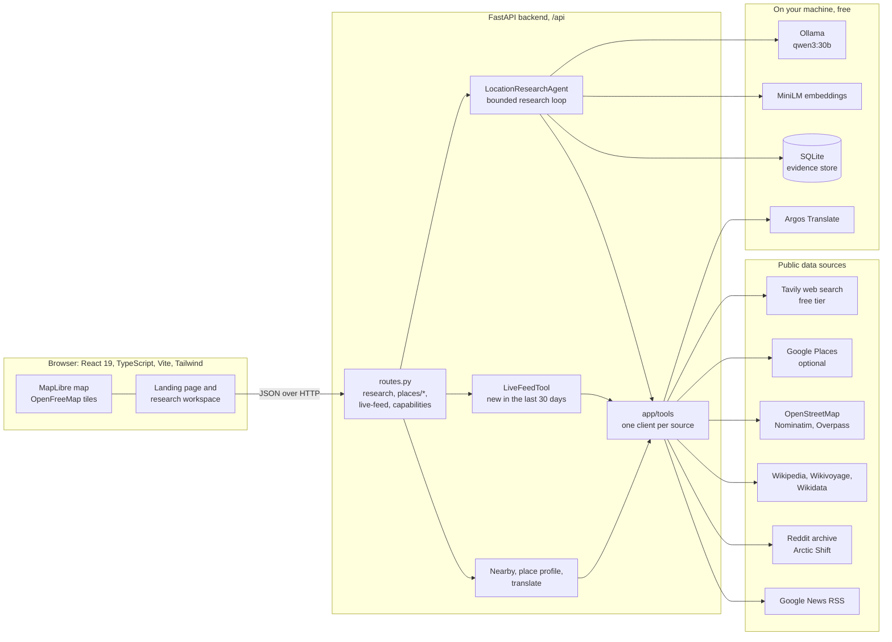
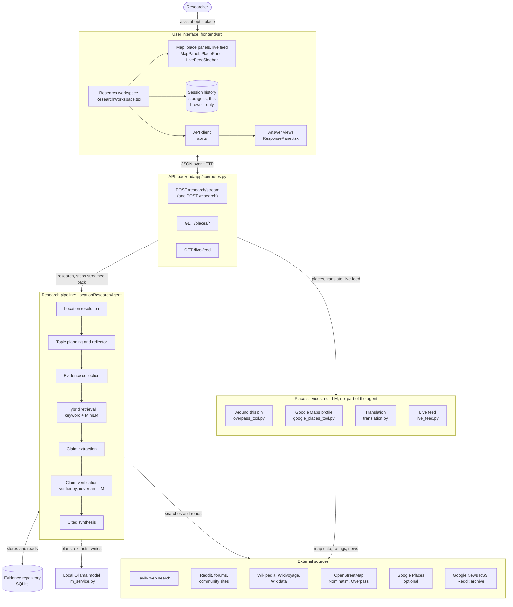
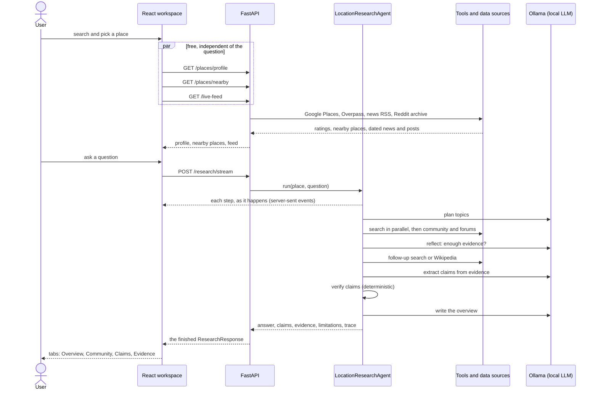
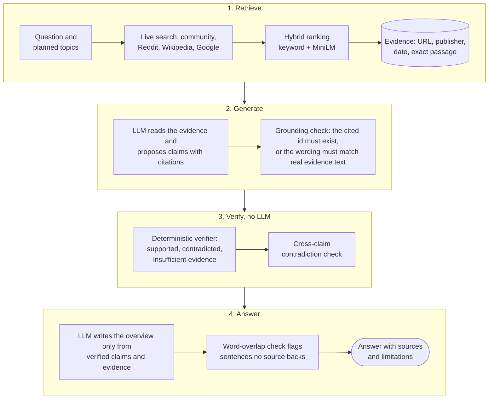

# Architecture

## Why one agent, not several

The hard problem here is adaptive retrieval and evidence-grounded reasoning, not
orchestration between specialized agents. A `LocationResearchAgent` calls into a set of
provider-independent tools and pipeline stages; there is no `NewsAgent` or `ReviewAgent`.
If a later milestone's evaluation shows a stage genuinely benefits from being run as an
independent agent (e.g. because it needs its own multi-step tool loop), that's the point
to reconsider — not before.

## System at a glance

A React front end talks to one FastAPI service, which holds the research agent, the live feed and the place
endpoints. All three reach the outside world only through `app/tools`, one small client per source; the AI parts (the LLM,
the embedding model, the translator) run locally.



### Components

The same system by component, with the files that implement each part. Two things it is easy to get wrong: the research agent does not call the live feed or the "Around this pin" lookup (they are separate place services behind their own endpoints), and OpenStreetMap enters the agent only through location resolution.



The same system as one request travels through it:



## Layers

```
app/models/       Pydantic schemas shared by every layer (Location, Evidence, Claim,
                   ResearchPlan/Topic, ResearchTraceStep, ResearchResponse)
app/core/         config (AgentConfig — loop/budget limits) + LLMService interface
app/tools/        LocationResolverTool, WebSearchTool, PageRetrievalTool, plus one client per source:
                   Google Places, Nominatim, Overpass, Wikimedia, Wikidata, Reddit archive, Google News RSS,
                   translation; live_feed.py and feed_topics.py (the live feed)
app/planning/     topic taxonomy + ResearchPlanner
app/retrieval/    EvidenceRetriever (keyword, semantic, hybrid)
app/evidence/     EvidenceRepository (in-memory, SQLite) + evidence enrichment (quality/recency)
app/synthesis/    ClaimExtractor + Synthesizer
app/verification/ ClaimVerifier + contradiction detection
app/agents/       LocationResearchAgent (orchestration) + factory wiring
app/api/          FastAPI route
```

Each layer that could swap in a real (networked, LLM-backed, or just heavier) implementation is an
abstract interface. Where a service isn't configured the default returns nothing and says so; it is
never a stand-in that invents data:

| Interface | Default when nothing is configured | Real implementation |
|---|---|---|
| `LocationResolverTool` | `UnconfiguredLocationResolver` (says geocoding is off) | `GooglePlacesLocationResolver` when `GOOGLE_PLACES_API_KEY` is set, then `NominatimLocationResolverTool` (free OpenStreetMap; opt-out via `DISABLE_LIVE_GEOCODING=1`), chained by `FallbackLocationResolver` (`build_location_resolver`) |
| `WebSearchTool` | `UnconfiguredWebSearchTool` (returns nothing; the response says search isn't configured) | `TavilyWebSearchTool` — real search via the Tavily API (opt-in via `TAVILY_API_KEY`) |
| `PageRetrievalTool` | `UnconfiguredPageRetrievalTool` (returns nothing) | `TavilyPageRetrievalTool` — reads full text Tavily already returned during search |
| `ResearchPlanner` | `KeywordResearchPlanner` (rule-based keyword → topic mapping) | `LLMResearchPlanner` — chooses from the fixed topic taxonomy via the LLM (opt-in via `OLLAMA_ENABLED`) |
| `EvidenceRetriever` | `KeywordEvidenceRetriever` (lexical term-overlap scoring) | `HybridEvidenceRetriever` (keyword + `SemanticEvidenceRetriever`, local `sentence-transformers`; auto-enabled if installed, opt-out via `DISABLE_SEMANTIC_RETRIEVAL=1`) |
| `EvidenceRepository` | `InMemoryEvidenceRepository` (per-run, not persisted) | `SQLiteEvidenceRepository` — durable, per-run-scoped local file, the actual default in `build_default_agent()` |
| `ClaimExtractor` | `UnavailableClaimExtractor` (no claims; says a model is needed) | `LLMClaimExtractor` — extracts from real evidence text (opt-in via `OLLAMA_ENABLED`). Grounding is enforced independently of the LLM's self-report: a cited evidence id/topic is checked against the real evidence given, and if that citation doesn't validate, `_best_matching_evidence()` recovers grounding by lexical overlap between the claim's own wording and the real evidence text — a claim is kept only if one of those two checks passes, never on the LLM's say-so alone |
| `ClaimVerifier` | `EvidenceBasedClaimVerifier` — relevance/recency checks, always; a second deterministic pass flags same-topic contradictions via a coarse antonym heuristic (never LLM-backed) | — (no alternative implementation; see "Provenance and honesty" below for why) |
| `Synthesizer` | `TemplateSynthesizer` — renders verified claims into prose via templates; for a topic with evidence but no claim, quotes the single most relevant *and* credible excerpt (blending relevance with a source-type quality score) rather than reporting only a gap | `LLMSynthesizer` — sees both verified claims and the full raw evidence (grouped by topic, labeled by source type/publisher/date), so it can answer the actual question from real evidence even when claim extraction found little; rejects absolute language, including absolute safety claims like "no crime has ever happened here" (opt-in via `OLLAMA_ENABLED`) |
| `LLMService` | — (none: without a model the LLM-backed components are simply not used) | `OllamaLLMService` (opt-in via `OLLAMA_ENABLED`, free and local). It is the only real implementation; the interface stays provider-independent, so another can be added without touching the pipeline |

`app/agents/factory.py` is the one place that wires concrete implementations together;
everything else — including `LocationResearchAgent` itself — depends only on the interfaces,
via constructor injection. `build_default_agent()` auto-detects `OLLAMA_ENABLED`, `TAVILY_API_KEY`, live geocoding, and whether `sentence-transformers` is
installed, independently of each other, and picks components accordingly with no other code
changing either way. Every LLM-backed implementation also falls back to its deterministic
counterpart on failure (bad JSON, API error, a rejected/ungrounded response) — see
`docs/research-workflow.md`'s "LLM integration" section for exactly what is and isn't trusted to
the LLM.

## Retrieval-augmented generation, and where it is checked

The model never answers from memory: it sees retrieved evidence, and what it writes is checked twice, each claim against
its cited source by a deterministic verifier and each overview sentence against the retrieved text.



## Why hybrid retrieval, not just semantic

`KeywordEvidenceRetriever`'s real, documented limitation was that a query for "commute options"
won't match a passage that only says "getting to campus" — no shared literal tokens.
`SemanticEvidenceRetriever` (local `sentence-transformers` embeddings, no API key) fixes exactly
that gap; `tests/test_semantic_retriever.py` demonstrates it on that literal example.
`HybridEvidenceRetriever` blends both scores rather than replacing keyword with semantic
outright, because semantic similarity can also drift toward loosely-related passages that share
a topic but not real relevance — neither method strictly dominates the other. The blend ratio
(`keyword_weight`, default 0.5) is not tuned against a labeled benchmark; that tuning is exactly
what would need to happen before trusting the ratio itself, as opposed to the general approach.

## Provenance and honesty by construction

Every `Evidence` object carries its source URL, publisher, source type, retrieval and
publication timestamps, and the exact passage used — the schema makes it structurally
impossible to state a claim without a traceable source. `Claim.status` is set only by
`ClaimVerifier`, never by whatever proposed the claim text (rule-based or LLM), so "a claim was
extracted" and "a claim is supported" can never be conflated. This holds regardless of whether
an LLM is in the loop — `ClaimVerifier` is never LLM-backed and never moves in the pipeline
order (see `docs/research-workflow.md`). Its contradiction check is a real but deliberately
coarse keyword-antonym heuristic (`app/verification/contradiction.py`), documented as exactly
that rather than oversold as full natural-language understanding. Remaining known gaps
(no evidence at all unless live search is configured, no claims without a model) are surfaced in every
response's `limitations` field rather than hidden.

## Milestone status

All eight milestones from the original project plan are implemented, plus later additions
(9 onward, below); what's opt-in vs. free by default is summarized in the interface table above.

- **Milestone 1:** the deterministic pipeline, first built and tested against invented fixture
  documents for two neighborhoods. Those fixtures have since been moved out of the product (see the
  last milestone below).
- **Milestone 2:** LLM-backed planning, claim extraction, and synthesis — opt-in via the free
  local `OLLAMA_ENABLED`, falling back to its Milestone 1 counterpart on failure.
- **Milestone 3:** live web search + page retrieval via Tavily — opt-in via `TAVILY_API_KEY`,
  independently of the LLM key.
- **Milestone 4:** hybrid (keyword + local-embedding semantic) retrieval — auto-enabled if
  `sentence-transformers` is installed, opt-out via `DISABLE_SEMANTIC_RETRIEVAL=1`.
- **Milestone 5:** `SQLiteEvidenceRepository` — durable, per-run-scoped local storage, the
  actual default (`InMemoryEvidenceRepository` still exists and is used directly in unit tests).
- **Milestone 6:** cross-source contradiction detection in `ClaimVerifier` — a coarse,
  deterministic antonym heuristic, not full NLU (see above).
- **Milestone 7:** the React + TypeScript frontend (`frontend/`) with an OpenStreetMap-based
  map (Leaflet at the time, MapLibre since Milestone 17) — a thin client that renders exactly what the API returns; see `frontend/README.md`.
- **Milestone 8:** the evaluation benchmark was actually run (Baseline B vs. the proposed
  system's orchestration, live search, without the LLM-backed components) and results — including where the
  proposed system did *not* win — are reported in `docs/evaluation.md`, not just planned.
  Baseline A and claim-level metrics remain unmeasured.
- **Milestone 9:** research isn't limited to a neighborhood — `NominatimLocationResolverTool` /
  `NominatimPlaceSearchTool` resolve and search for any real point of interest (a specific
  business, address, building) via free OpenStreetMap Nominatim, opt-out via
  `DISABLE_LIVE_GEOCODING=1`. A free-text query is tried as-is and then progressively broadened
  by dropping leading segments, because OSM knows addresses far better than business names —
  "Venezuela, 20 Ericsson St, Boston, MA 02122" returns nothing while the address alone resolves
  exactly, and the name the user typed is kept for display. Naming a US state also constrains the
  search to that country, without which a business name that is also a country name hijacks the
  geocode entirely ("Venezuela, Boston, MA" resolved to a street in Venezuela). Picking one exact POI from live search passes the already-resolved
  `Location` straight into the agent (`LocationResearchAgent.run()` accepts `str | Location`),
  skipping re-resolution so a same-named place nearby can't be silently substituted.
- **Milestone 10:** the independent, region-scoped live feed (`TavilyLiveFeedTool` /
  `GET /api/live-feed`) and a rework of claim extraction and synthesis so a real, useful body of
  evidence doesn't collapse into "insufficient evidence":
  - The live feed reports on the broader area (city/region), not the specific selected place —
    querying and filtering are anchored on the region. It searches Tavily's *news* topic across
    several complementary facets and merges them: the general topic returned no publication date
    at all for any result and mostly evergreen landing pages, so items are required to carry a
    real publication timestamp, which doubles as the quality filter. Locality is checked against
    the publisher/URL as well as the text, accepting a hyper-local outlet outright while
    requiring everything else to name the state too (a Cambridge, MA query otherwise surfaced a
    Cambridge, *New York* police report).
  - `LLMClaimExtractor` recovers grounding deterministically (`_best_matching_evidence`, lexical
    overlap against real evidence text) when a model cites a source name or an invented topic
    label instead of the literal evidence id/topic it was given, rather than dropping every claim
    a weaker model produces.
  - `Synthesizer.synthesize()` now sees the full evidence set, not only already-extracted claims,
    and returns a structured `SynthesisResult` (`summary`, `key_findings`, `details`,
    `recommendation`) — both `TemplateSynthesizer` and `LLMSynthesizer` can produce a real,
    question-answering Overview even when claim extraction found little or nothing, instead of
    defaulting to "insufficient evidence" purely because one precisely-formatted extraction step
    didn't succeed.

- **Milestone 11:** places in any language. `Translator` / `ArgosTranslator`
  (`app/tools/translation.py`) machine-translates foreign-language evidence to English locally
  (Argos Translate, free, no key; language packs download on first use), *before* the relevance
  filters, since a Japanese page never spells the place the way an English query does. The
  original title and text are kept in `Evidence.metadata` and the UI labels every translated item;
  text that can't be translated is flagged, never dropped or faked. Nominatim is asked for English
  names, a missing prefecture/state is recovered from the display name, and the minimum-length
  filter counts CJK characters at their real information weight (a plain `len()` discarded short
  but complete Japanese passages).
- **Milestone 12:** a specific business is researched as a business, and gets real map and
  ratings data. `Location.is_business` (from OpenStreetMap's `category`) switches the plan to
  business-specific queries, and `_mentions_business` / `_mentions_place_context` require a page
  to name the business's distinguishing words *and* the right city, with no soft fallback. Three
  data sources sit beside web search, each independent of the LLM: `OverpassNearbyTool` ("around
  this pin" from OpenStreetMap map data, with a mirror fallback and a cache), `GooglePlacesTool`
  (rating, hours, Google's review summary as cited evidence; optional, needs
  `GOOGLE_PLACES_API_KEY` and billing), and `best_excerpt` (`app/synthesis/excerpt.py`), which
  gives the model the passage of a page that matches the question rather than its first few hundred
  characters, usually navigation. Checked live against Google, `reviews` came back absent for a
  busy place on both endpoints while `reviewSummary` came back fine, so the summary is kept and
  labeled as Google's own AI text.
  A user-reported miss (a restaurant in Kurume pasted as a plus code) showed the deeper problem:
  the place was being *found* by OpenStreetMap, which lacks the business and can't read plus codes,
  so it was never flagged as a business and Google was never asked. `GooglePlacesTool.search_places`
  and `GooglePlacesLocationResolver` now resolve places first when the key is set, with OpenStreetMap
  as fallback; the same question then returned Google's 3.9 stars from 384 reviews plus a Tabelog page.
- **Milestone 13:** the dependency and pipeline cleanup. The Anthropic provider and the Firecrawl
  integration were removed: neither was exercised (no key was ever used for the first; the second
  fired on 0 of 14 measured pages and returned neither cleaner text nor dates), and a billed model
  API doesn't fit a project that is meant to stay free. What remains is one LLM provider (Ollama)
  behind the provider-independent `LLMService` interface, GitHub Actions for CI, security and
  release, and Dependabot. The default model moved from `llama3.2:3b` to `qwen3:30b` (a
  mixture-of-experts model, ~3B active parameters) with thinking mode off and Ollama's integrated-GPU
  backend on: measured at 192 s for a business question and 259 s for a neighbourhood question,
  against 15+ minutes for the same model on CPU only. `backend/README.md` has the full timing table
  and how each number was obtained.
- **Milestone 14:** an audit of whether the agent and the RAG were doing what the project claims found
  four gaps, all now addressed. (1) *The agent didn't decide anything*: a fixed sequence; the
  `ADDITIONAL_RESEARCH` trace stage only logged. It now has a bounded reflect-then-act loop over two
  tools (`app/agents/reflection.py`; see `docs/research-workflow.md`). (2) *Retrieval never saw the
  question*: the search used one fixed template query per topic; follow-up queries are now built from
  the question. (3) *"Supported" meant less than it sounded*: a model-written claim that cited a real
  evidence id was marked supported without anyone checking its wording, so a real citation could
  vouch for an invented sentence. The verifier now also requires the claim's content words (at least
  half) and every figure in it to appear in the sources it cites (`app/verification/support.py`).
  (4) *The overview was unchecked prose*: sentences that no single source backs are now listed in the
  limitations as the model's own inference. Both checks are lexical, not natural-language inference:
  they can reject a faithful paraphrase that shares few words, but cannot accept a statement whose
  words and figures aren't in the source. Added `WikiContextTool` (free, CC BY-SA) as the second
  tool. Checked live on one question (an 82-94 s run became 193 s, the extra time being two short
  model decisions plus a second search, and it found the town's official tourism page the first pass
  missed); not yet benchmarked.
- **Milestone 15:** worldwide coverage. The system had only been exercised on two US neighborhoods, so
  it was probed against 15 places on every inhabited continent (`evaluation/global_coverage.py`, which
  anyone can re-run) and the defects fixed: English-only search (14 of 15 places returned only English
  sources) now supplemented by local-language search on the place's native-script name
  (`app/tools/locale.py`, `app/planning/local_queries.py`); substring keyword matching that planned
  *nightlife* for "Barcelona"; a topic set built around a US college student (added attractions,
  climate, customs, healthcare, and visitor and newcomer personas); islands and beaches treated as
  businesses; a pin 158 km off for "Sukhumvit, Bangkok"; official sources recognised only as `.gov` /
  `.edu`; Latin-only text and digit handling in the verification checks; right-to-left rendering; and
  an Overpass server that failed for 6 of 15 places. Local-language search exposed a real cost: the
  free translator takes ~11 ms per character on a laptop CPU, which made one live run exceed 25
  minutes, so translation is now limited to pages that mention the place (checked on the original
  text), 6 per search, and their first 700 characters. Live runs on four places finished in 135-330 s.
  Known limits, stated in the README: languages the translator has no pack for get English-only search;
  an ambiguous name (in Arabic "Zamalek" is also a football club) can surface irrelevant pages, which
  the claim checks then mostly exclude; not a benchmark of answer quality.
- **Milestone 16:** removing invented data from the product. An audit found that on an install with no
  keys, asking about Harvard Square returned 12 fabricated sources (`.example.net` URLs, publisher
  "(fixture)") and 8 claims marked *supported*, with a confident summary and no warning, and that the
  landing page showed a made-up sample answer citing real domains that were never checked. Both are
  gone: the fixture documents, their tools and the `/api/locations` demo-places endpoint moved to
  `tests/` (nothing under `app/` may reference them; a test enforces that), unconfigured tools return
  nothing and say so, `LLMClaimExtractor` no longer falls back to canned claims, and the landing page
  describes what a response contains without asserting anything about a place. Also removed the unused
  `FakeLLMService`, and merged two duplicate copies of the resolver-chain builder.

- **Milestone 17:** sources beyond Google, a live feed about a place rather than its last week, and a
  rebuilt UI. (1) *Community and regional sources*: `app/tools/community_sources.py` holds two curated
  domain lists, global (Reddit, TripAdvisor, Wikivoyage, Quora, Lonely Planet, ...) and per-country (for
  example PTT and Dcard for Taiwan, Naver for Korea, Tabelog for Japan, Pantip for Thailand), and
  `community_domains(country_code)` puts the country's own first (this function and the domain-restricted English
  search were removed in Milestone 28: the restriction hid Reddit). A second `TavilyWebSearchTool`, built in
  `agents/factory.py` with `include_domains_for`, searched only those domains and fed the same
  translate-then-filter pipeline, so a forum page has to name the right place exactly as a web page does.
  This first version mixed every community site into one English query, and a search for Taiwan appeared to
  find nothing on PTT or Dcard, which I first wrote up as Tavily not indexing them. That was wrong: searched on
  their own (PTT and Dcard in Chinese) they return real threads, and the mixed query was simply dominated by
  Pixnet and TripAdvisor. The community search is now split (see `docs/research-workflow.md`), and the live
  feed searches Reddit plus the country's forums only. Login-walled social networks still contribute little. (2) *English first*: `ingest` orders
  evidence so English and machine-translated-to-English items come before untranslated local-language ones,
  which stay available and labeled. (3) *Live feed*: `TavilyLiveFeedTool` no longer means "last 7 days
  around the exact point". It searches the place's city and widens once to the region around it (Xinyi
  District, then Taipei City) when the city yields under 6 items, over a 30-day window, and returns news and
  community conversation, each item tagged with the scope it came from. It first widened all the way to the
  country, which cost up to 9 billed searches a load on a plan of 1,000 credits a month and returned stories
  about Taiwan rather than Taipei, so it was cut back: two scopes, one news query and one community query
  each (2 to 4 searches), decided on the total rather than per kind, cached for an hour per place and per city
  (so a second place in the same city reuses the region's search), one shared load for simultaneous requests,
  a failed search never cached, and `search_depth="basic"` set explicitly. `refresh=true` bypasses the cache
  for the refresh button. `/api/live-feed` resolves the country code with the same `LocaleResolver` the
  research agent uses. (4) *UI*: the workspace is now a top navigation bar over three columns (map and question box,
  answer, live feed); see `frontend/README.md`. Leaflet and the hand-written CSS files were replaced
  by MapLibre GL with free OpenFreeMap vector tiles (English label first, local script beneath), Tailwind
  utilities and Headless UI (a three.js globe and framer-motion were added here and removed in Milestone 19). (5) *CI*:
  `pip-audit` failed on two transitive advisories; raising the `pytest`, `sentence-transformers` and
  `transformers` floors fixed all but one (PYSEC-2026-3075 in `stanza`), which is explicitly ignored in
  `dependency-audit.yml` with the reason: `argostranslate` pins `stanza` below the fixed version. Remove
  the exception when Argos allows `stanza >= 1.12.2`.
- **Milestone 18:** dates on forum posts, and the community sources that were wrongly written off. Tavily returns
  no `published_date` for Reddit, PTT or Dcard, so `app/tools/post_dates.py` reads it from the post: the creation
  time in a PTT URL, a batch lookup of Reddit thread ids in the Arctic Shift archive (one request, checked against
  Reddit's own feed for a sample), and JSON-LD or `article:published_time` metadata on blogs. It is applied to
  forum, review and blog evidence that survived the relevance filters, and to the live feed's community posts, which
  are then listed newest first. Reddit's own feed is throttled to about one request a minute, which is why it is only
  a fallback. The requests use no search credits, are capped and time-limited, refuse private addresses, and can be
  turned off with `DISABLE_POST_DATE_FETCH=1`. Dcard (Cloudflare 403) and the login-walled networks stay undated.
  Also fixed: the live feed's place filter rejected almost every Reddit thread because it wanted "Taipei City" and
  people write "Taipei"; a name is now also accepted without its trailing "City" or "District" (the region check still
  applies, so a Cambridge, New York report still cannot appear in a Cambridge, MA feed). The feed's community search
  is now Reddit plus the country's forums (TripAdvisor, YouTube and the social networks crowded it with listings
  and videos) with wording that finds discussion, and research questions get a separate local-language forum search.
- **Milestone 19:** fixes from using it on a real place (Hunts Bank & Victoria Station Approach, Manchester).
  (1) *Google Maps content missing for a named venue*: the pin was a station approach, not a business, so Google was
  never asked about the AO Arena the question named. `venue_named_in` now adopts a place the question names that
  stands within 300 m (found by popularity, since by distance the arena was not in the nearest 20), and its Google rating opens the key findings. (2) *"Around this pin" empty*: the public Overpass
  servers were slow or shedding load for a dense centre and every attempt had the same 15 s timeout; now five servers
  with their own timeouts, a stale-answer fallback, a one-hour cache and no 400-element cap. (3) *Live feed descriptions were
  page chrome*: `app/tools/descriptions.py` keeps only whole sentences; the source link now sits under the headline. (4)
  *The map was near-black*: the dark OpenFreeMap style was used in dark mode; both maps now use the light style.
  (5) *three.js and framer-motion removed*: they were asked for, then judged unnecessary. The globe is gone (search is
  back to a street-map backdrop), every transition is CSS, and the main bundle fell from 542 KB to 411 KB. Also learned
  the hard way: MapLibre's unlayered stylesheet overrides Tailwind's `absolute` on the map's element.
- **Milestone 20:** the landing page was rebuilt as a dark single-page product page (a sticky nav, a hero over a real
  street map holding the working search, a preview of an answer's shape drawn with placeholder bars, a source strip,
  tabs by kind of question, three facts about the design, the five steps, principles and honest limits, an FAQ), after
  studying five product pages. What it copied is layout and pacing. What it deliberately did not copy is the social proof:
  no testimonials, user counts, customer logos or sample answer, because there are none to show and an invented one is
  what this project exists not to do. A place chosen in its search opens the workspace directly through router state,
  and a question chosen there waits in the question box; nothing is run for the user. Also cleaned the working tree of
  generated caches (`__pycache__`, `.pytest_cache`, `.ruff_cache`, `frontend/dist`, Vite's `.vite` and `.tmp`, and the
  local `backend/data/evidence.db` of past runs), all regenerated on demand and gitignored, and confirmed that no commit on
  any branch carries a `Co-Authored-By` trailer.
- **Milestone 21:** feedback on the rebuilt interface. (1) *Google Maps content was missing for general questions*:
  "is it a good place to visit as a tourist?" about Ginkaku-ji returned no Google rating or reviews, while naming the
  place did. The pin was an address, and then a landmark, neither a business; see `docs/research-workflow.md` for how
  each kind of pin now gets its Google data, and `backend/README.md` for the measurements behind popularity ranking and
  exact-name matching. `GET /api/places/popular` lists rated places around a pin that is not one place.
  (2) *Cluttered*: Google Maps and "Around this pin" were two stacked cards; they are one tabbed panel, the Google tab
  shows the rating, a clamped summary and two reviews (the rest on request), and the nearby card is a compact grid of
  categories instead of a scrolling carousel. (3) *Names in another script*: `POST /api/places/translate` and a
  "Translate to English" button. (4) *Community voices*: Google Maps supplied most of them and came first; they are now
  filterable by site and mixed across sites by default. (5) *Landing page lag*: blur filters over a moving page were the
  cause (a sticky `backdrop-blur` header re-blurred every frame over a WebGL map, and a 54 rem element blurred by 140 px);
  they are now gradients, the backdrop map renders at pixel ratio 1 and is taken out of compositing while off screen, and
  sections below the fold use `content-visibility`. (6) *Workflows*: see the next milestone.
- **Milestone 22:** the CodeQL failures, read from the run logs. The analysis scanned every file and then the step
  after it failed with "Resource not accessible by integration ... get-a-workflow-run". My first explanation (code scanning
  is a paid feature on a private repo) was a guess made without the logs, and the logs disagreed: the cause on a private
  repo is a missing `actions: read` permission, now granted, and on Dependabot's pull requests a read-only token that can
  never upload, so the job skips them. The eight open Dependabot PRs all showed 4 of 9 checks failing, the same four each time, which points at
  infrastructure and not at their changes: the two CodeQL jobs, and most likely the secret scan (it lacked `pull-requests:
  read`) and the dependency review (it tried to comment on a PR with a token that cannot, and on a private repo it needs
  the dependency graph). Only the CodeQL cause is confirmed from a log; the other two are inferred. Dependabot went from weekly to monthly, two open PRs at most, no
  automatic major bumps (two of the eight were majors: TypeScript 7 and sentence-transformers 6, plus `@types/node` 26 against
  Node 24). Actions were bumped where the annotations named it (`codeql-action` v4, `checkout` v5); the rest is left to
  Dependabot's own actions PR.
- **Milestone 23:** the place panel was a second set of tabs (Google Maps, Around this pin) sitting above the answer's tabs
  (Overview, Community, Claims, ...) and beside the live feed's (News, Community): three tab strips on one screen. It became two
  folding boxes drawn as small browser windows, with a chip in each header. The Google box starts with the well-known places
  around an area; when the answer adopts or names a specific place, that content is replaced by the place's own ratings and
  reviews, and the panel says so, so the replacement is not missed. The first load of a place's reviews is not flagged, only a
  replacement. (Superseded in its look by Milestone 24; the replacement indicator carried over.)
- **Milestone 24:** feedback on the boxes was that the answer's tabs should be *tabs* and the place panel should look like the
  browser tabs in a reference image. So: the answer's Overview / Community / Claims / Evidence / Details are Tailwind-style
  underlined tabs (with count badges), and the place panel is two browser-style tabs (rounded tops; the selected one flows
  into the panel through concave feet, in plain CSS in `index.css`), with a chevron to fold it. "Updated" is now a pulsing dot
  on the Google Maps tab (visible at any width) plus the line inside; the dot clears when the tab is clicked, the line when
  dismissed. (Milestone 23's version faded after twelve seconds and was missed; it no longer expires.) The Google tab shows
  every review Google returns in a list with a visible scrollbar, replacing the "show more" toggles, and the opening hours
  moved to a small window opened from "Open now" beside the review count. **Map links in Around this pin were wrong in kind,
  not in coordinates:** the coordinates come straight from OpenStreetMap and are right, but a Google Maps link made of
  coordinates alone opens a bare pin titled with the numbers. Links are now a search for the place's name (and street)
  centered on its coordinates, which opens the real listing (checked on a restaurant, a chain shop with several branches, and a
  Japanese tea house). Bus stops, tram stops and subway entrances keep the exact-coordinate pin: a name search for a bus stop
  matched an art gallery and a different stop. Landing page: the search box and example places were removed (the app opens on
  one), the navbar spans the full width so the app button sits at the far right, the map credit control was dropped from the
  landing backdrop (the footer credits map sources in general terms; the in-app maps keep theirs), the footer carries the
  copyright line, and the preview under the hero was redrawn to match the current workspace (still placeholder bars, no figures).
- **Milestone 25:** two findings from a hotel in Erfurt. (1) The map panel's "Open in Google Maps" link was a bare coordinate,
  which Google opens as a pin titled "50°58'21.9"N 11°01'44.2"E" with no listing; beside the hotel's own listing it looked like
  a different spot. It was not: the coordinates came from Google's own search result and the two markers coincided (checked by
  measuring both against neighbouring landmarks). The link was wrong in kind, as the "Around this pin" links had been. A pin
  picked from a Google result now keeps Google's place id (`PlaceCandidate.google_place_id`) and the link opens that exact
  listing; other pins use a search for the name or address centered on the coordinates. A name search alone is not enough for
  hotels: it opens Google's hotel results, with ads, which is why the id is carried. The id is cleared when the answer moves
  the pin to another place. (2) The translate button was offered only for non-Latin scripts, on the reasoning that a German
  name is a proper noun; but "Bundespolizeiinspektion Erfurt" and "Neue Marien-Apotheke im Facharztzentrum Angerbrunnen" are
  as opaque to a visitor as Japanese. Names in any script are now translated where the country isn't English-speaking (60
  Erfurt names took about 14 s on this laptop, half of them changed), with the original beneath and the machine-translation
  label; Latin-script street addresses are still left alone, and single capitalised words are skipped after the translator
  turned the supermarket "REWE" into "REWEB".
- **Milestone 26:** the landing page's live map behind the hero could come up blank on a refresh or a first visit (a WebGL map
  draws grey until its tiles arrive, which took ten seconds or more in testing), and it was decoration. It is now a still image,
  rendered once from OpenFreeMap's style of OpenStreetMap data (a one-off capture; the first attempt came out blank because it
  read the canvas before the tiles had loaded, the same failure in miniature), 254 KB, so the page has nothing moving or
  re-drawing. The workspace preview under the hero was cut to the top of the layout with a fade, since showing all of it made it
  taller than the screen. (Superseded in Milestone 37: the search page's map is now an image.) The search page keeps a live map and now drifts up and down slowly on its own (26 s a sweep, eased
  at each turn, off for reduced motion) and fades in when its first frame is drawn, so the grey wait is not seen.
- **Milestone 27:** four things from a review of the running product. (1) **Reddit had disappeared from the feed and the
  Community tab.** Measured against the live API (Erfurt): `include_domains=["reddit.com"]` at basic depth returns
  subreddits and pages unrelated to the place, alone or in a list with a country's forums, and the feed's query wording
  ("what is it like") matched song titles; the place filters rightly dropped all of it. The same search with "reddit" as a
  word in the query and no domain filter returns real threads, so the feed searches Reddit that way, keeping only Reddit's
  own thread pages. The feed found 14 dated Erfurt threads (it had none). The country's forums in the feed became a
  fallback, searched only when Reddit leaves the feed thin, because a second billed search per scope was the cost of
  separating them; a failed Reddit search does not trigger it. (A Reddit search of its own for the research agent was
  built and then removed: it cost a credit more on every question. Milestone 28 gets Reddit into Community Voices without
  it.) Untouched and worth knowing: a business named for its city ("Hotel Erfurt-City") matches any thread that names the
  city. (2) **"Around this pin" looks 1,000 m** around the pin
  instead of 600. Public-server timings, cold: 3 s in central Manchester, 6 s in Erfurt, 12 s in Shibuya. (3) **CodeQL**
  analyses cleanly; what failed was the upload, with "Code scanning is not enabled for this repository". That is a
  property of a private repository without GitHub Code Security, not of the workflow. It now uploads only where code
  scanning exists (public repository, or the `CODE_SCANNING` variable set), and otherwise keeps the SARIF file as an
  artifact and prints findings in the job summary and as annotations (`.github/scripts/codeql_summary.py`), never failing
  the job for a finding. (4) **Dependabot's pull requests went from 8 to 6** because it closed the two whose bumps the
  config now ignores (TypeScript 7, `@types/node` 26); nothing new was opened. The five Python PRs still open predate the
  grouping and are replaced by one grouped PR at its next monthly run.
- **Milestone 28:** a Reddit thread that exists never reached Community Voices. The example was the place "Pa Sak Jolasid
  Dam the floating train" in Thailand, whose thread (r/ThailandTourism, two years old) is titled with exactly that text.
  Three separate causes, each measured. (1) The research community search sent a list of eleven domains, which returned
  YouTube, Facebook and TikTok pages and no Reddit; it is now steered by its query (which starts with "reddit") with no domain
  list, at 20 results instead of 4 (one credit either way), so it costs nothing extra. (2) The place filters rejected what
  it found: Google labels the place "Tambon Manao Wan, Chang Wat Lopburi" and "Floating Train at Pa Sak Jolasid Dam", which
  no page writes. Leading administrative words are ignored, "Pa Sak" equals "Pasak" and "Lop Buri" equals "Lopburi", a name
  with three or more identifying words matches in any order and then does not also need the city, Google's " - Lop Buri" tag
  is dropped, and a search is anchored to the province when the city is a subdistrict. Checked against counter-cases: a
  two-word name is not matched in any order. (3) Even when found and accepted, the thread lost the top-four cut to travel
  pages that scored slightly higher, so the community search's results are now kept forum threads first (Reddit and real
  forums ahead of Facebook, Instagram, YouTube and TikTok posts, which are classed as community sources but are rarely
  something to read), and at most two per site while others remain. Through the real search and the agent's own scoring the
  thread now reaches the answer's evidence for two of the three entries Google lists for that place; for the third, Tavily did
  not return it in the runs made (its ranking varies call to call). The country's forums no longer ride along in the English
  search for places with no known native name. Also fixed on the way: the community query for a question-less request had
  dropped the place's own name. The live feed gained the same name cleanup: it searched "Tambon Manao Wan, Chang Wat Lopburi",
  and now searches "Manao Wan, Lopburi" and finds dated Lopburi threads.
- **Milestone 29:** "as close to complete as you can", for what people say about a place. The limit was never the filters
  alone: a web search returns a ranked sample, so a thread that exists can be absent from it whatever the filters do (the
  third of Google's entries for the Pa Sak dam never had the thread returned). So a source that is not a sample was added.
  (1) **Reddit archive** (`reddit_archive.py`): Arctic Shift, a public copy of Reddit, searched by words in a post's title
  inside the place's own subreddits (found by name prefix), its country's, and the big travel ones. Free, no Tavily key, real
  posting times. Measured: text search needs a subreddit; comment search times out; a title search takes 5 to 8 s; and it
  rations requests (HTTP 429 with a reset time) after roughly two back-to-back runs of twelve, which I hit in testing and
  which made two live runs return nothing until the client learned to wait out short refusals, stop on long ones, and cache
  for an hour. Live, the thread that started all this came back for all three Google entries. (2) **Other names**
  (`wikidata_names.py`): Wikidata's English label and aliases for the entity at the pin, kept on `Location.name_variants` and
  used by every place filter and by the archive search, for the romanisation problem. It only helps a place Wikidata knows.
  (3) **A bug the archive exposed**: a business named for its city (Hotel Erfurt-City) matched any text containing "Erfurt"
  and "city", so the archive's first result for it was five off-topic posts (a flag collection, drug posts, a train story).
  Such a name must now appear as a phrase. (4) `filter_for_place` was extracted from the Tavily tool so both sources use one
  set of place rules. What is still not covered: text in comments, sites a search never returns, login-walled networks,
  Google's five reviews, and spellings Wikidata does not list. Tavily's credit counter was at 864 of 1,000 for the month when this
  was written; the archive and Wikidata spend none.
- **Milestone 30:** the live feed said "the last 30 days" and showed Reddit posts three months old. Only the news search was
  windowed (Tavily's `days` applies to its news topic); community posts were never filtered by date, and Tavily returns no
  publication date for Reddit at all. Now everything is cut to 30 days after its date is known, and a post whose date cannot
  be read is dropped, since it cannot be shown to be inside the window (Dcard posts, login-walled sites: the price of a
  strict window). A date cut alone would have left the feed nearly empty, so Reddit comes first from the free archive asked
  for posts after a date, which returns the last 30 days directly and spends no credit; the billed Reddit search is a fallback
  when that leaves the feed under 3 posts, so a busy city's feed can cost one search instead of two. **A bug found only by
  running it live:** the archive's `r/cambridge` is Cambridge, England, so a feed for Cambridge, Massachusetts filled with
  posts about the University of Cambridge and Trumpington. City subreddits are now verified against their own descriptions
  when the name is shared (r/CambridgeMA, r/cambridgeont), with two further mistakes caught by the control runs and fixed:
  a sub's long sidebar can mention another country, so the short description is tried first; and a crypto sub called
  KyotoSwap made Kyoto look ambiguous, so only a 2 or 3 letter code counts as a place qualifier. The archive's contribution is
  capped at the 30 newest (Kyoto returned 75). Not verified: the billed Tavily paths were exercised with fake clients only,
  since the credit counter was at 864 of 1,000.
- **Milestone 31:** the live feed became "what is new at and around the place". Asked for: a blinking red dot; the last 30
  days newest first with "Now" then later dates; crime, accidents, articles, community and business information; at the
  pin and its streets first, the city only if nothing is there; nothing at all when there is nothing; no politics and nothing
  irrelevant; and the place named on each item instead of in the intro. Built as `LiveFeedTool` over free sources, because the
  billed search cost credits (864 of 1,000 already used) and returned a ranked sample: Google News' public RSS feed, which takes
  a date window and quoted street names and returns real publication times and real local outlets (Patch, Cambridge Day, NBC
  Boston), plus the Reddit archive. Tavily became a fallback below 3 items. Politics and irrelevance are keyword rules on the
  headline (deterministic, free, blunt), items get one of eight kinds by the first matching rule, and the UI is one timeline with
  kind filters instead of News and Community tabs. **Bugs found only by running it live**, each now fixed and tested: the street
  at a city's centre point ("Broadway") pulled in New York theatre news, so a city-level pin has no street; OpenStreetMap put
  Harvard Square in "Charlestown", so a headline must name the street or area *and* the city; my "outlet named for the area"
  rule accepted the outlet "Broadway News" for the street Broadway, so it now means a website named for the area; and the busy
  city subreddits' personal asks ("roommate wanted", "best cat vet?") were not information about the place, so community posts get
  one more rule. Measured: Harvard Square 7 items in 7 s, Cambridge (city) 60 items, Hunts Bank nothing near and so
  Manchester, and no politics or film trivia in any. Two judgement calls: the city is used only when there is *nothing* near (as
  asked), so one nearby item hides the city's news and Reddit; and an empty feed shows a single line, not nothing at all. Not
  covered: article text (headlines only), languages other than the country's English edition, and street-level Reddit (it has
  city subreddits, not street ones).
- **Milestone 32:** documentation and a landing-page fix. The README gained the landing-page screenshot, a tech-stack section,
  an author line, a table of contents, and five Mermaid diagrams (system, research pipeline, retrieval and
  verification, live feed, one request end to end), also placed in this file, `research-workflow.md` and the backend README.
  The diagrams are validated by rendering them, and four of them were redrawn after the first renders were hard to read (a system
  diagram with 27 crossing lines, a 3,200-pixel-tall pipeline). The screenshots were taken from a headless browser against
  a local run; the Google Maps tab is left out of them because it shows reviewers' names. Found while taking them: the landing
  page's workspace preview still drew the old News/Community tabs for the live feed, so it now draws the blinking dot and the
  Now/Today grouping. An audit found no credentials in the working tree or in any commit on any branch, no commit carrying a
  co-author line, and no fabricated sample content in the product (its invented fixtures live only under `backend/tests`).
- **Milestone 33:** progress streaming and browser tests. A research run takes minutes on a local model and the page showed a
  spinner. `LocationResearchAgent.run` now takes an optional `on_step` callback, called with each trace step as it is recorded
  (an exception in it is swallowed: a progress display must not change a run), and `POST /api/research/stream` sends those steps
  as server-sent events, then the same `ResearchResponse` as `POST /api/research`, or an error event. The run stays in one worker
  thread because the evidence store's SQLite connection belongs to the thread that opened it; a client that goes away does not
  cancel it. Four "starting" steps were added before the slow model calls (planning, the reflector, claim extraction, the
  overview), because without them the stream fell silent for exactly the long waits. A crash inside a streamed run is logged
  and the reader gets a fixed message, not the exception text (the same information-exposure rule as the code-scanning fixes).
  Measured on a real run with keys blanked: the first step arrived after 2.9 s, and the stream showed "Selected Reddit archive
  search" through a 39-second wait that used to be a silent spinner. The UI has 14 Playwright tests (7 in a real browser over the
  dev server with the backend mocked, 7 plain unit tests). Writing them found a real bug, two siblings sharing one React `key` in
  the answer panel, now fixed. Not done: cancelling a run from the page, and streaming partial claims (steps are streamed, not
  partial answers).
- **Milestone 34:** an answer-quality evaluation, and one thing not built. `evaluation/answer_quality.py` answers ten questions with
  the model alone, the model handed all the sources, and the full pipeline, over the same frozen sources collected free from
  Wikipedia, the Reddit archive and Google News RSS (no search credit), and scores every answer with deterministic measures
  (`quality_metrics.py`): sentences no single source backs, figures and names in no source, and whether citations are real.
  `FrozenSearch` lets the real pipeline read a fixed evidence set with everything that reaches the network switched off. Results,
  in `docs/evaluation.md`: 53% of the model-alone answers' specifics are in no source, 10% with sources handed over, 4% for the
  pipeline, which is about four times slower than the sources-handed-over baseline. Building it found two bugs in its own measure
  (names joined across a line break; provenance ignored), fixed after the first results and disclosed with both sets of numbers,
  and made `assess_sentences` public so the sentence check can report how many sentences it judged. **Not built: article text for
  the live feed.** Google News RSS links do not lead to the publisher: each of four tried returned a 580 KB Google page that redirects
  by script. Reaching the article means calling Google's undocumented internal API, which is unofficial scraping that can break or
  be blocked at any time, so it was left out; items keep their headline, real time and outlet.
- **Milestone 35:** compare two places, export, and saved places, all in the front end (no backend change). *Compare* runs the existing
  streamed research once per place, one after the other because the local model is one machine, and shows both answers with a table of
  what each run found. It does not rank the places or write any sentence about which is better: nothing in the sources decides that,
  and a model-written verdict would be an unverified synthesis of two evidence sets. *Export* builds Markdown in the browser from the
  response on screen (claims with their sources, limitations, numbered sources); there is no PDF. *Saved places* live in
  `localStorage`, on the search page rather than the landing page, because the landing page has no place picker. The tests (25 in all)
  found one thing worth writing down: an error event ends a run at once and the app moves straight on to the second place, so a test
  that also closed the stream afterwards was closing the *second* run's stream. Not done: comparing three or more places, different
  questions for each place, keeping comparisons, and any cross-place synthesis.
- **Milestone 36:** the leftovers from the earlier list. *Mobile:* measured horizontal overflow of every screen at 320, 375, 390 and
  768 px (none), looked at the 375 px screens, and fixed the one real problem, the place's name shrinking to "Harv…" beside the pin
  badge and three buttons (the badge is now hidden on small screens); a permanent test asserts no screen scrolls sideways at
  320, 375 and 768 px. The empty state said "on the left", which is wrong on a phone. *PDF:* "Print / Save as PDF" prints the same
  report as a print-styled page from a hidden frame (no PDF library, nothing uploaded; every source-supplied string is escaped, and a
  test checks that markup in a title or address cannot get through). *Compare on real data:* run through the real UI with the keys
  blanked; it works, and its columns honestly show "no evidence" where the free sources found none. *Human review:* the automatic
  measures cannot say whether an answer is right, so `review` writes a sheet of the ten cases' answers under shuffled letters (the
  order differs per case) with the sources beside them and an empty ratings file, and `score-review` unblinds the ratings; the
  blinding is partial, since the pipeline's answers have a recognisable shape. The ratings have not been made, and they take a person.
  *Repo files:* `SECURITY.md`, `CONTRIBUTING.md`, issue and pull-request templates, `CITATION.cff`. *Docker:* written (Dockerfiles for both services, nginx for the built front end, a compose file with Ollama on the host), then
  **removed**: there was no Docker on the machine, so it could never be built or shown to work, the app needs Ollama on the host
  either way, and unverified infrastructure is a liability. It is in the git history if someone wants to build on it. The CI's browser tests were also run locally on Playwright's own
  Chromium, as CI runs them, and pass. *Demo GIF* (`docs/images/demo.gif`, 4.6 MB): a real run recorded through the real app in free mode
  (no search key, so no credit spent), with the four-minute model wait time-lapsed 30 times; it is a truthful demo and a modest one, since
  with no web search the answer is thin, the one claim the model made was flagged insufficient because its wording was not in its cited
  source, and the Details tab lists what was not searched.
- **Milestone 37:** a round of fixes from use. *Backdrops:* the landing map was Tokyo and the search page's a random world city;
  both became an image of Midtown Manhattan (Milestone 38 gave the landing page its own close-up). The search page's map had been a live one that showed seconds after everything else
  (it waited on tile requests and WebGL); it is now that image, present with the page and drifting on a diagonal by CSS. *Live feed:*
  the news was already Google News' public RSS; it now links to Google News' own results, and the intro no longer says "No politics".
  *Multiple questions in one prompt:* before, the whole prompt went through as one string, so the plan's topics covered every question
  but nothing made the answer address each or say which one the evidence could not answer. `split_prompt` (plain rules, cautious: a
  sentence typed with a question mark but starting like a statement, "I heard a great deal about it?", is context, not a question)
  now finds the questions, the trace says how many, and the writer is told to answer each in a numbered paragraph and to say so for
  any it cannot. Checked on the real model with a three-part prompt: it answered the two questions in numbered paragraphs and dealt
  with the third, a mistyped statement, honestly ("Food expense levels were not addressed in the evidence"). This does not split the
  *research* per question. *Saved places:* they were only listed on the search page, which is not where anyone looks after saving;
  the star is now a menu with the list, a count and remove. *Export:* the three text buttons became icons with tooltips at the right of
  the tab row, and the tab spacing was tightened because at 1280 px the tabs and icons no longer fit together. *Compare* is centred.
  *The "what it is doing" panel* showed a growing step list, a bar, timing and two paragraphs at once; it now shows the timing and the
  current step, with the rest behind a link. *The Hugging Face warning* ("unauthenticated requests to the HF Hub") came from checking
  the Hub for the small search model on every start; a model already on the machine is now loaded from it, quietly and in 0.2 s, and
  fetched only the first time. Tests: 561 backend, 42 frontend (23 in a browser, 19 plain unit tests).
- **Milestone 38:** three things from looking at Milestone 37 in use. *Landing map:* a close-up of Midtown Manhattan (zoom 14.7,
  rendered at 2x) with street names, transit stops and building shading; zoom 15.3 was tried first and was too heavy, with dark 3D
  building sides everywhere. The search page keeps the wider image. *The drift:* the diagonal drift used CSS `ease-in-out` between two
  ends of a sweep, so it crept for several seconds before it seemed to move, and at 48 s a sweep it was about half the pace of the old
  live map, which is the pace that was liked. It is now a sine path traced in 21 keyframes, linear between them, that starts mid-sweep
  and already moving (52 s a cycle, about 5 px a second); a test asserts it has moved more than 5 px on both axes within two seconds
  of load. *"Box inside a box":* the agent panel was a card containing a bordered current-step box and a bordered step list; the
  current step is now two plain lines and the history a timeline, so the card is the only container. Tests: 42 frontend, 561 backend.
- **Milestone 39:** more from use. *Landing map:* zoom 14.7 was too close and dense, so it is now zoom 14.1 (street names and transit
  stops, without every building shaded), re-encoded from 719 KB to 442 KB. *Landing preview card:* the drawn workspace on the landing
  page was still the Milestone 22 layout; it now shows the top bar as it is (Saved, Compare, Change location), a Details tab, the
  print, download and copy icons at the right of the tabs, and the feed's filter chips. *Search backdrop:* the wish was for what the
  live map gave (a different city each visit, street level) without the wait it caused. So the live map is not back: eleven world
  cities are drawn in advance as street-level images, one is picked at random per visit, and only that one is downloaded (about 175 KB;
  the folder is read with `import.meta.glob` for addresses only). Tests: 43 frontend (24 in a browser, 19 plain unit), 561 backend.
  The new backdrop test first counted Vite's per-file address modules as downloads in development and then timed out under load with
  the other tests running; both were the test's fault, not the page's.
- **Milestone 40:** four more fixes from use. *Landing map:* still "3D and messy" after two zoom changes, because the cause was not the
  zoom: the map style draws buildings as extruded 3D shapes from about zoom 14, and their dark sides under the headline read as a
  tilted mess. The image is now drawn with that layer removed (flat, 2D), at zoom 14.1, and is smaller (308 KB). *Search backdrop:*
  one map per visit became a slideshow: the maps rotate by themselves every 26 s with a 2.5 s crossfade, the next one fetched while the
  current shows so a change never waits, and the drift direction cycles through across, up and down, and both diagonals (vertical
  scaled 1.6 so it covers about as much ground as horizontal). Writing the test found a real bug: the timer that removes the map that has
  faded out was in the same effect as the slide timer, and that effect's cleanup cancelled it on every change, so the old layer would
  have stayed underneath forever. *Top bar:* Saved places and Compare are icons only, with tooltips; the landing preview card matches.
  *Duplicated location:* the line under a place's name repeated the city ("Chi-Joan How, Boston" over "Boston, Massachusetts, United
  States"); it now leaves out what the name already says. (The report said "the country locations is duplicated" and its screenshot
  did not arrive, so this is the repeat visible in earlier screenshots; if another is meant, it is not fixed.) Tests: 49 frontend (27 in
  a browser, 22 plain unit), 561 backend.
- **Milestone 41:** the "duplicated country" was in the search suggestions, not the top bar (Milestone 40 guessed the wrong one; the
  top bar's repeated city was a real repeat too, and that fix stays). Typing "germany" listed Germany twice. Two causes, both found
  with a live query: `/api/places/search` puts Google's results first and drops OpenStreetMap entries within 150 m of one, and Google's
  "Germany" and OpenStreetMap's are hundreds of kilometres apart, so both survived; and OpenStreetMap alone returns "Paris, Ile-de-France,
  Metropolitan France, France" three times (the city, the department, its boundary). The route now keeps each full name once, the first
  (Google's) winning; places that share only a short name keep their own addresses, so every Starbucks is still there, and a different
  Paris (Texas) is still offered. The box also filters rows that would look identical. The live feed's Google News link moved to the
  right-hand corner. Tests: 563 backend, 50 frontend (28 in a browser, 22 plain unit).
  *Landing preview card (later the same day):* about 30 px taller (452 px on desktop, was 400), with the suggested questions under the
  question box and the feed ending in "See more on Google News" in its right-hand corner, so the drawing matches the workspace.
- **Milestone 42:** three things noticed in use. *The pin map looked 3D:* nothing about it had changed (`MapPanel.tsx` was last edited on
  20 September), but it uses the same OpenFreeMap "liberty" style as the landing map, which draws buildings as raised shapes from about
  zoom 14, and the pin map's zoom is 16.2. It is now flattened the same way: `flattenMap` (`mapFlat.ts`) removes the style's
  `fill-extrusion` layers when the style loads, and the flat outlines, streets, names and stops stay. Checked on the real map with real
  tiles. *No space under the last suggested question:* the left column scrolls, and the sidebar box was allowed to shrink to fit it,
  so its content spilled out of the box and its bottom padding was lost (the fix is `shrink-0`; a test scrolls the column to the end
  and asserts at least 16 px under the last suggestion, and was checked to fail without the fix). *The landing card's feed ended
  differently from the app's:* the app has the cards, then a centred "Show N more" button, then the Google News link in the right corner;
  the card had the link without the button. It now has both, and "Try asking:" carries its colon as in the app. Tests: 563 backend, 53
  frontend (29 in a browser, 24 plain unit).

- **Milestone 43:** two things left over from the last round. *A tooltip showed behind the open Saved-places menu:* the star button's
  "Saved places" label kept showing while its menu was open and peeked out from behind it; the label is now not rendered while the
  menu is open (a test checks it is gone then and back after). *The landing card's live-feed header had the red dot on the wrong
  side:* the app has "Live feed", then the dot, with the refresh button at the far right; the card had the dot first. It now matches
  (a test checks the order in both places, and both new tests were checked to fail on the old code). Tests: 563 backend, 56 frontend
  (32 in a browser, 24 plain unit).
  A follow-up: the top bar's tooltips (Saved places, Compare) were lined up with their button's right edge, so on these small buttons
  they hung off to the left; they are now centred under the button (a test checks it). Frontend is now 57 tests (33 in a browser).
  *Images refreshed:* `docs/images/workspace.jpg` and `docs/images/demo.gif` were re-taken from a new real run (Harvard Square, "Is it a
  good place to visit as a tourist?", free mode with no search or Google key, so no credit spent) so they show the current top bar, agent
  panel and live feed. The answer is a thin, honest one for the same reason as before (no web search: mixed/partial evidence, 1 of 4
  topics supported); the model wait is time-lapsed 30 times in the GIF (4.2 MB).
