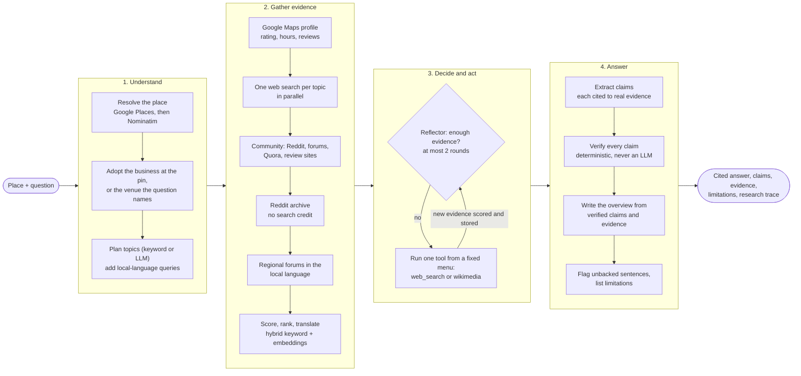

# Research Workflow

The whole run, as `LocationResearchAgent._run` executes it (a fixed sequence with one decision loop in the middle):



The same sequence as text, with the classes that do each step:

```
INPUT (a place, a question)
  -> LOCATION RESOLUTION        Google Places, then OpenStreetMap Nominatim
  -> IS THE PIN THE PLACE ASKED ABOUT?   adopt the business at an address, or a venue the question names
  -> OTHER NAMES                Wikidata spellings of the name
  -> RESEARCH PLANNING          KeywordResearchPlanner, or LLMResearchPlanner if OLLAMA_ENABLED is set
  -> LOCAL-LANGUAGE QUERIES     where the country's web is not in English
  -> GOOGLE MAPS PROFILE        rating, hours, reviews (with GOOGLE_PLACES_API_KEY)
  -> FIRST PASS                 one web search per topic, in parallel
  -> COMMUNITY SEARCH           Reddit, forums, Quora, review sites
  -> REDDIT ARCHIVE             posts whose title names the place; no search credit
  -> REGIONAL FORUMS            the country's own forums, in its language
  -> SCORE, FILTER, TRANSLATE   hybrid keyword + embedding ranking; evidence stored
  -> DECIDE AND ACT             Reflector: enough, or web_search / wikimedia; at most 2 rounds
  -> COVERAGE CHECK             which planned topics ended up with zero evidence
  -> CLAIM EXTRACTION           LLMClaimExtractor (none without a model), grounded against real evidence
  -> CLAIM VERIFICATION         EvidenceBasedClaimVerifier    <- always deterministic
  -> SYNTHESIS                  Template- or LLM-based, from verified claims and evidence
  -> FINAL RESPONSE             ResearchResponse, including the full research_trace and limitations
```

Every stage above appends a `ResearchTraceStep` to the response — this is what "the user can
understand what the agent did" means concretely in this milestone.

## Adaptive topic selection

`KeywordResearchPlanner` (`app/planning/planner.py`) selects topics in three passes, in
priority order:

1. **Explicit mention** — if the question's own text matches a topic's keywords (e.g. it says
   "nightlife"), that topic is included at `HIGH` priority regardless of anything else.
2. **Persona bundle** — if the question matches a known persona (currently just
   `college_student`, triggered by phrases like "college student" or "undergrad"), that
   persona's default topic bundle (`housing`, `transportation`, `safety`,
   `student_amenities`, `cost_of_living`) is added at `MEDIUM` priority, without overriding
   anything already set to `HIGH`.
3. **Fallback** — only if neither of the above matched anything, a small generic bundle
   (`housing`, `transportation`, `safety`) is used at `LOW` priority, so the agent never
   researches nothing.

This is what makes "a nightlife question should not trigger extensive housing research"
concretely true: pass 1 selects only `nightlife`; passes 2 and 3 never run because
`topic_priority` is already non-empty. See `tests/test_planner.py`.

## LLM integration (Milestone 2) — where the LLM is trusted, and where it isn't

Setting `OLLAMA_ENABLED` swaps three components for LLM-backed versions
(`app/agents/factory.py` auto-detects this):

- `LLMResearchPlanner` — chooses which topics are relevant using real language understanding
  (e.g. "Is it easy to get around without a car?" implies `transportation` with no literal
  keyword match), but can only select from the fixed topic taxonomy in `app/planning/topics.py`
  — it cannot invent a topic, its queries, or its completion criteria.
- `LLMClaimExtractor` — extracts real claims from evidence passages instead of relying on
  pre-written claims. Every `supporting_evidence_ids` it returns is checked against
  the evidence actually given to it; ids that don't correspond to real evidence are dropped, and
  a claim left with none is dropped entirely (`app/synthesis/llm_claim_extractor.py`).
- `LLMSynthesizer` — drafts the summary/recommendation prose, but only from claims that have
  already been verified, and its recommendation is rejected (triggering a template-based
  fallback) if it uses disallowed absolute language like "guaranteed."

**Claim verification never becomes an LLM call, and it never moves.** It stays a fixed,
deterministic gate between extraction and synthesis regardless of which components are
LLM-backed: `EvidenceBasedClaimVerifier` is the same class either way. This is why the pipeline
order above is extract → verify → synthesize, not the "generate an answer, then check it"
pattern you might expect from an LLM-heavy system — letting an LLM draft a full narrative answer
and checking it afterwards would mean trusting the LLM not to introduce anything ungrounded in
the first place, which is exactly the failure mode `ClaimVerifier` exists to prevent. Likewise,
`deterministic_limitations()` (`app/synthesis/synthesizer.py`) computes coverage gaps and the
standing contradiction-detection caveat in code for both synthesizers, so an LLM that omits an
inconvenient limitation cannot make it disappear from the response.

Every LLM-backed component falls back to its rule-based or empty counterpart
on any failure — a malformed JSON response, a rejected recommendation, a network error, no valid
topics/claims — and records why in the response's `limitations`, rather than crashing the run
or silently degrading without saying so. See `tests/test_llm_planner.py`,
`tests/test_llm_claim_extractor.py`, and `tests/test_llm_synthesizer.py`, all of which exercise
this against a scripted fake `LLMService` rather than the real API.

## Live search (Milestone 3) — and why it needs the LLM key to be useful

Setting `TAVILY_API_KEY` swaps `WebSearchTool`/`PageRetrievalTool` for `TavilyWebSearchTool`/
`TavilyPageRetrievalTool` (`app/tools/tavily_tools.py`), independently of `OLLAMA_ENABLED`.
Tavily returns full page text (`include_raw_content=True`) in the same call as the search
results, so the page-retrieval tool just reads from a cache the search tool already populated
rather than making a second real HTTP request per source.

Real results don't arrive labeled with a clean `source_type` — `_classify_source_type()` is a
coarse, honest heuristic keyed on domain (`.gov` → `local_government`, `reddit.com` →
`community_forum`, etc.) that defaults to `SourceType.OTHER` rather than guessing wrong.

**The important interaction: live search alone produces evidence without claims.**
Reading a claim out of a real page needs a model, so with `TAVILY_API_KEY` set but
not `OLLAMA_ENABLED`, a run collects real evidence that never becomes a claim
(`UnavailableClaimExtractor` says so). This is not a
bug being papered over: `deterministic_limitations()` reports it explicitly as *"Evidence was
found for planned topic 'x' but no claims could be extracted from it"* — distinct from *"No
evidence was found"* — so real, gathered evidence with no claim is never confused with a
genuine coverage gap. Confirmed against the live API: asking about Harvard Square nightlife
with only `TAVILY_API_KEY` set returns real evidence from Yelp, Reddit, and a local blog, zero
claims, and exactly that limitation message. Setting both keys is what makes live search
actually produce claims, via `LLMClaimExtractor`.

## Retrieval: why lexical first

`KeywordEvidenceRetriever` scores each candidate by term overlap against the topic's search
queries. It is deterministic and requires no embedding model, which is why it's what runs
today — but it is a real limitation, not a stylistic choice: a query for "commute options"
will not match a passage that only says "getting to campus," because they share no literal
tokens. `docs/evaluation.md` describes how that specific failure mode gets measured before a
semantic retriever is added on top.

## The research loop's bound

`AgentConfig.max_tool_calls` (default 30) counts every external tool call — each topic's
search plus each accepted candidate's full-text fetch — so the loop is guaranteed to
terminate. When the budget runs out mid-topic, that topic is skipped and a
`"Research budget exhausted..."` limitation is recorded rather than silently truncating
results. `AgentConfig.max_evidence_per_topic` and `min_relevance_score` bound how much
evidence a single topic can contribute and how weak a match can still be accepted.

## The decide-and-act loop

The first pass is fixed: plan topics, search each once, score, keep what clears the relevance bar.
What happens next is a decision. `app/agents/reflection.py` defines a `Reflector` that receives the
question, what evidence exists per planned topic, and the queries already tried, and returns either
"enough" or up to `max_actions_per_round` actions from a fixed menu:

- `web_search` — search again with a new query. The first pass used fixed per-topic templates
  that never contain the user's question; the follow-up is built from it.
- `wikimedia` — Wikipedia articles near the pin and the Wikivoyage guide for the town
  (`app/tools/wiki_tool.py`), for visiting/nearby questions or when web search found nothing.

With an LLM enabled, `LLMReflector` makes the choice; anything it proposes outside the menu, for an
unknown topic, or repeating a tried query is discarded, and if the call fails or returns garbage
`RuleBasedReflector` decides instead and the limitation says so. The *agent* executes the actions,
so the model can pick and phrase but cannot run anything itself. Results pass through the same
relevance filter and budget as the first pass. The loop runs at most `max_research_rounds` (default
2) times and stops early when the reflector says enough or `max_tool_calls` is spent, so it always
terminates. Every decision is a trace step (`ADDITIONAL_RESEARCH`), including "enough".

The loop is only wired when live search is on: with no search configured there is nothing to search again, and the
run is the single fixed pass.

## A place named in the question

Before planning, `LocationResearchAgent` checks whether the pin is really the place the question is about. A pin
on a street address adopts the business standing at it (`_adopt_business_at_address`). A pin on a corner or a
station approach adopts a place the *question names* (`_adopt_venue_named_in_question`): Google is asked for the 20
most popular places within 300 m (popularity, because by distance the arena beside Manchester Victoria was not among
the nearest 20), and the first whose whole distinguishing name is in the question becomes the subject. It is asked
only when the question contains a capitalized word that does not merely start a sentence, streets and areas are never
adopted, and the response says what happened in its limitations. A pin that is a named place but not a business (a
temple, a museum) gets a quiet exact-name Google lookup as evidence without being switched to business mode, so a
general tourist question about it carries its Google rating and reviews too; an address adopts the most popular place
within 60 m, landmarks included; an area matches nothing. The business's Google listing then enters as
evidence, and its rating opens the key findings unless a finding already states it.

## Places outside the English-speaking world

Before the first search, `LocaleResolver` reverse-geocodes the pin to find the country and looks up the
country's main written language (only languages the free translator can read back are listed). For
such a place the plan gains one query per top topic in that language, built around the place's
native-script name (`ResearchTopic.local_queries`). `TavilyWebSearchTool` runs it alongside the English
query and merges the results by URL; the retrievers still score only the English queries, because
they score English text. Pages are accepted on the native name as well as the English one. For an
English-speaking place, or one whose language can't be translated, nothing changes and the trace says
why (`RESEARCH_PLANNING`). Any failure in the lookup is a limitation, never an error.

## Forums and regional communities

Web search alone returns listicles and hotel pages; what a place is *like* is said in threads. After the
per-topic searches, `LocationResearchAgent` runs up to three more (two spend a search credit; the Reddit archive search
is free) (`app/tools/community_sources.py` holds the query and the forum lists):

- an **English community search** for what people say: Reddit, forums, TripAdvisor and other review sites, steered by
  a query that starts with "reddit" and **not restricted to a domain list** (a list hid Reddit: measured, it returned
  video and social pages and no thread for a place that has one), with `community_query()`: a business by its name plus city, an area by its name plus the question;
- a **regional forum search in the local language** over the country's own forums (PTT, Dcard, Pixnet, Naver,
  Pantip, ...), for a place that has a native name. It is separate because an English query never reaches
  those forums, and mixing them into one query let Pixnet and TripAdvisor crowd out PTT and Dcard. It uses the
  plan's first local-language query (a topic as well as the name finds threads about the place; the name alone
  finds threads that merely mention it), else the native name.

- a **Reddit archive search** (free, no key: `app/tools/reddit_archive.py`) for posts whose title names the place, in its own,
  its country's and the big travel subreddits, using every name the place goes by (`Location.name_variants`, from Wikidata).
  A web search returns a sample; the archive is Reddit itself, so a thread that a search never surfaces is found, with its real
  posting time. Titles only, a few requests, rationed by the archive, cached for an hour.

Results go through exactly the same steps as any web page (translation first, then the place-relevance
filters), so a forum thread has to name the right place to count, and a page is classified forum, then review
site, then community list (`_classify_source_type`). Forum, review and blog results that survive get their real
publication date from `post_dates.py` (URL, a Reddit archive, page metadata) because the search API supplies
none. During evidence ingestion, English and machine-translated-to-English items sort before untranslated
local-language ones; nothing is dropped for its language. Not everything is reachable: login-walled social
networks and Dcard refuse a plain request, which shows up as fewer sources or "date unknown", not as an error.

## Claim extraction without an LLM

Without a model there is no claim extraction: `UnavailableClaimExtractor` returns no claims and adds
a note that a model is needed, and the response still lists the sources it found. There used to be a
`FixtureClaimExtractor` that returned pre-written claims attached to invented fixture documents, and
`LLMClaimExtractor` fell back to it on failure. It was removed from the product because it let
invented statements pass as research; it survives only in `tests/fixture_tools.py`, where it drives
the end-to-end tests. When `LLMClaimExtractor` fails it now produces no claims and says so.

